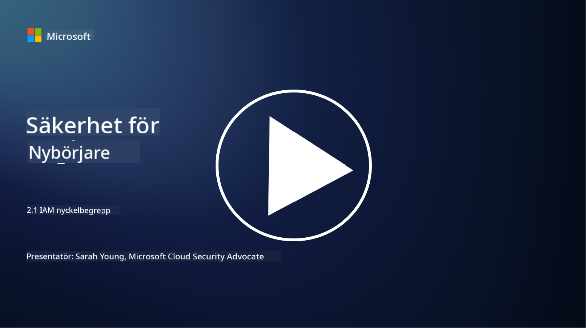

<!--
CO_OP_TRANSLATOR_METADATA:
{
  "original_hash": "2e3864e3d579f0dbb4ac2ec8c5f82acf",
  "translation_date": "2025-09-03T22:40:20+00:00",
  "source_file": "2.1 IAM key concepts.md",
  "language_code": "sv"
}
-->
# IAM nyckelbegrepp

Har du någonsin loggat in på en dator eller en webbplats? Självklart har du det! Det betyder att du redan har använt identitetskontroller i din vardag. Identity and Access Management (IAM) är en viktig del av säkerhet, och vi kommer att lära oss mer om det i de kommande lektionerna.

**Introduktion**

I denna lektion kommer vi att gå igenom:

- Vad menar vi med Identity and Access Management (IAM) i
  cybersäkerhetssammanhang?
  
- Vad är principen om minsta privilegium?
  
- Vad är arbetsfördelning?
  
- Vad är autentisering och auktorisering?

## Vad menar vi med Identity and Access Management (IAM) i cybersäkerhetssammanhang?

Identity and Access Management (IAM) syftar på en uppsättning processer, teknologier och policyer som implementeras för att säkerställa att rätt individer har lämplig åtkomst till resurser inom en organisations digitala miljö. IAM handlar om att hantera digitala identiteter (användare, anställda, partners) och deras åtkomst till system, applikationer, data och nätverk. Det primära målet med IAM är att förbättra säkerheten, förenkla användaråtkomst och säkerställa efterlevnad av organisationens policyer och regler. IAM-lösningar omfattar vanligtvis användarautentisering, auktorisering, identitetsförsörjning, åtkomstkontroll och hantering av användarlivscykeln (se till att konton tas bort när de inte längre används).

## Vad är principen om minsta privilegium?

Principen om minsta privilegium är ett grundläggande koncept som förespråkar att ge användare och system endast de minimala privilegier som krävs för att utföra deras avsedda uppgifter eller roller. Denna princip hjälper till att begränsa potentiella skador vid en säkerhetsöverträdelse eller intern hot. Genom att följa principen om minsta privilegium minskar organisationer attackytan och risken för obehörig åtkomst, dataintrång och oavsiktligt missbruk av privilegier. I praktiken innebär detta att användare endast får åtkomst till specifika resurser och funktioner som krävs för deras arbetsroller, och inget mer. Till exempel, om du bara behöver läsa ett dokument, skulle det vara överdrivet att ge dig fullständiga administratörsprivilegier för dokumentet.

## Vad är arbetsfördelning?

Arbetsfördelning är en princip som syftar till att förhindra intressekonflikter och minska risken för bedrägerier och fel genom att fördela kritiska uppgifter och ansvar mellan olika individer inom en organisation. I cybersäkerhetssammanhang innebär arbetsfördelning att säkerställa att ingen enskild individ har kontroll över alla aspekter av en kritisk process eller ett system. Målet är att skapa ett system med kontroll och balans som förhindrar att någon enskild person kan utföra både inställnings- och godkännandestegen i en process. Till exempel, i finansiella system kan detta innebära att personen som registrerar transaktioner i systemet inte ska vara samma person som godkänner dessa transaktioner. Detta minskar risken för obehöriga eller bedrägliga handlingar som går obemärkta.

## Vad är autentisering och auktorisering?

Autentisering och auktorisering är två grundläggande begrepp inom cybersäkerhet som spelar en avgörande roll för att säkerställa säkerheten och integriteten hos datasystem och information. De används ofta tillsammans för att kontrollera åtkomst till resurser och skydda känslig information.

**1. Autentisering**: Autentisering är processen att verifiera identiteten hos en användare, ett system eller en enhet som försöker få åtkomst till ett datasystem eller en specifik resurs. Det säkerställer att den påstådda identiteten är äkta och korrekt. Autentiseringsmetoder innefattar vanligtvis användning av en eller flera av följande faktorer:
    
    a. Något du vet: Detta inkluderar lösenord, PIN-koder eller annan hemlig information som endast den auktoriserade användaren bör känna till.
    
    b. Något du har: Detta innefattar fysiska tokens eller enheter som smartkort, säkerhetstokens eller mobiltelefoner som används för att bekräfta användarens identitet.
    
    c. Något du är: Detta syftar på biometriska faktorer som fingeravtryck, ansiktsigenkänning eller näthinneskanningar som är unika för en individ.
    

Autentiseringsmekanismer används för att bekräfta att en användare är den de utger sig för att vara innan åtkomst till ett system eller en resurs tillåts. Det hjälper till att förhindra obehörig åtkomst och säkerställer att endast legitima användare kan utföra åtgärder inom ett system.

**2. Auktorisering**: Auktorisering är processen att bevilja eller neka specifika behörigheter och privilegier till autentiserade användare eller enheter när deras identitet har verifierats. Det avgör vilka åtgärder eller operationer en användare får utföra inom ett system eller på specifika resurser. Auktorisering baseras ofta på fördefinierade policyer, åtkomstkontrollregler och roller som tilldelats användare.

Auktorisering kan ses som att besvara frågan, "Vad får en autentiserad användare göra?" Det handlar om att definiera och upprätthålla åtkomstkontrollpolicyer för att skydda känsliga data och resurser från obehörig åtkomst eller modifiering.

**Sammanfattningsvis:**

- Autentisering fastställer identiteten hos användare eller enheter.
- Auktorisering avgör vilka åtgärder och resurser autentiserade användare får åtkomst till eller manipulera.

## Vidare läsning

- [Describe identity concepts - Training | Microsoft Learn](https://learn.microsoft.com/training/modules/describe-identity-principles-concepts/?WT.mc_id=academic-96948-sayoung)
- [Introduction to identity - Microsoft Entra | Microsoft Learn](https://learn.microsoft.com/azure/active-directory/fundamentals/identity-fundamental-concepts?WT.mc_id=academic-96948-sayoung)
- [What is Identity Access Management (IAM)? | Microsoft Security](https://www.microsoft.com/security/business/security-101/what-is-identity-access-management-iam?WT.mc_id=academic-96948-sayoung)
- [What is IAM? Identity and access management explained | CSO Online](https://www.csoonline.com/article/518296/what-is-iam-identity-and-access-management-explained.html)
- [What is IAM? (auth0.com)](https://auth0.com/blog/what-is-iam/)
- [Security+: implementing Identity and Access Management (IAM) controls [updated 2021] | Infosec (infosecinstitute.com)](https://resources.infosecinstitute.com/certifications/securityplus/security-implementing-identity-and-access-management-iam-controls/)
- [least privilege - Glossary | CSRC (nist.gov)](https://csrc.nist.gov/glossary/term/least_privilege)
- [Security: The Principle of Least Privilege (POLP) - Microsoft Community Hub](https://techcommunity.microsoft.com/t5/azure-sql-blog/security-the-principle-of-least-privilege-polp/ba-p/2067390?WT.mc_id=academic-96948-sayoung)
- [Principle of least privilege | CERT NZ](https://www.cert.govt.nz/it-specialists/critical-controls/principle-of-least-privilege/)
- [Why is separation of duties required by NIST 800-171 and CMMC? - (totem.tech)](https://www.totem.tech/cmmc-separation-of-duties/)

---

**Ansvarsfriskrivning**:  
Detta dokument har översatts med hjälp av AI-översättningstjänsten [Co-op Translator](https://github.com/Azure/co-op-translator). Även om vi strävar efter noggrannhet, bör du vara medveten om att automatiska översättningar kan innehålla fel eller inexaktheter. Det ursprungliga dokumentet på dess ursprungliga språk bör betraktas som den auktoritativa källan. För kritisk information rekommenderas professionell mänsklig översättning. Vi ansvarar inte för eventuella missförstånd eller feltolkningar som uppstår vid användning av denna översättning.