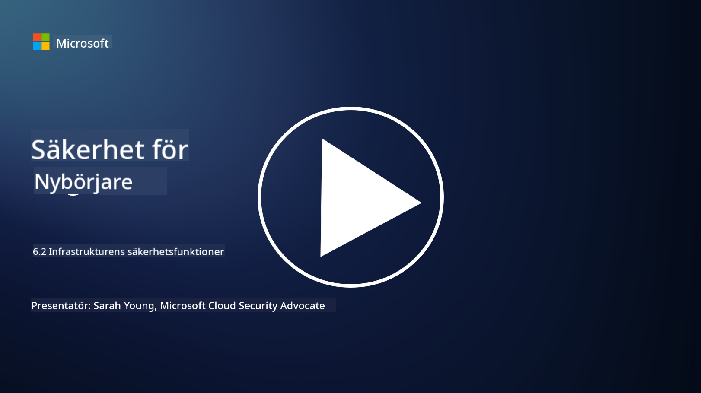

<!--
CO_OP_TRANSLATOR_METADATA:
{
  "original_hash": "7d79ba0e7668b3bdae1fba7aa047f6c0",
  "translation_date": "2025-09-04T00:12:43+00:00",
  "source_file": "6.2 Infrastructure security capabilities.md",
  "language_code": "sv"
}
-->
# Säkerhetsfunktioner för infrastruktur

I det här avsnittet går vi igenom mer detaljer om de centrala verktygen och funktionerna som används inom infrastruktursäkerhet.

**Introduktion**

I denna lektion kommer vi att gå igenom:

- Vad är sårbarhetshantering?

- Vad är CSPM?

- Vad är CNAPP?

## Vad är sårbarhetshantering?

Sårbarhetshantering är en systematisk process för att identifiera, utvärdera, prioritera, åtgärda och övervaka sårbarheter i datorsystem, mjukvara, nätverk och infrastruktur. Det primära målet med sårbarhetshantering är att minska en organisations exponering för säkerhetsrisker genom att proaktivt hantera kända sårbarheter innan de kan utnyttjas av illasinnade aktörer. Här är en översikt över de viktigaste stegen:

Identifiering: Skanning och upptäckt av sårbarheter i organisationens tillgångar, som kan inkludera servrar, applikationer, nätverksenheter och slutpunkter.

Bedömning: Utvärdering av allvaret och den potentiella påverkan av varje sårbarhet baserat på faktorer som Common Vulnerability Scoring System (CVSS) och affärskontext.

Prioritering: Rangordning av sårbarheter baserat på deras risknivå och potentiella påverkan på organisationens verksamhet och data.

Åtgärd: Utveckling och implementering av strategier för att åtgärda eller mildra sårbarheter, vilket kan inkludera att applicera patchar, konfigurera säkerhetsinställningar eller implementera kompensationskontroller.

Verifiering: Bekräftelse på att åtgärderna var effektiva för att hantera sårbarheterna.

Kontinuerlig övervakning: Löpande spårning av sårbarheter och potentiella hot, med regelbundna skanningar och bedömningar.

Sårbarhetshantering är en kritisk del av cybersäkerhet och hjälper organisationer att upprätthålla en stark säkerhetsnivå och minska risken för säkerhetsintrång. Exempel på verktyg för sårbarhetshantering är Defender for Cloud, Nessus och Qualys.

## Vad är CSPM?

Cloud Security Posture Management (CSPM) är en uppsättning verktyg, processer och metoder som är utformade för att bedöma, övervaka och upprätthålla säkerhetskonfigurationer och bästa praxis i molnmiljöer. CSPM-lösningar hjälper organisationer att identifiera och åtgärda felkonfigurationer, säkerhetsluckor och efterlevnadsöverträdelser i deras molninfrastruktur, såsom i Amazon Web Services (AWS), Microsoft Azure, Google Cloud Platform (GCP) och andra molnleverantörer.

Viktiga aspekter av CSPM inkluderar:

- Konfigurationsbedömning: Skanning av molnresurser och tjänster för att identifiera felkonfigurationer, osäkra inställningar och avvikelser från säkerhetsbästa praxis.

- Säkerhetspolicyimplementering: Upprätthållande av säkerhetspolicyer och efterlevnadsstandarder i molnmiljöer genom att automatiskt åtgärda felkonfigurationer eller generera varningar.

- Kontinuerlig övervakning: Tillhandahållande av kontinuerlig insyn i säkerhetsläget för molntillgångar och resurser, med realtidsvarningar för säkerhetsincidenter.

- Efterlevnadsrapportering: Generering av rapporter och instrumentpaneler för att visa efterlevnad av regulatoriska krav och branschstandarder.

CSPM hjälper organisationer att säkerställa att deras molninfrastruktur är säker, följer regler och är i linje med bästa praxis, vilket minskar risken för säkerhetsincidenter relaterade till molnet. Exempel på CSPM-verktyg inkluderar Defender for Cloud och Snyk.

## Vad är CNAPP?

CNAPP står för Cloud-Native Application Protection Platform. Det är en allt-i-ett molnbaserad mjukvaruplattform som förenklar övervakning, upptäckt och hantering av potentiella säkerhetshot och sårbarheter i molnet. Den kombinerar flera verktyg och funktioner i en enda mjukvarulösning för att minska komplexiteten och underlätta arbetet för DevOps- och DevSecOps-team. CNAPP erbjuder en helhetslösning för säkerhet i moln och applikationer genom hela CI/CD-applikationslivscykeln, från utveckling till produktion. Den möter branschens behov av moderna verktyg för säkerhetsövervakning, hantering av säkerhetsläget, förebyggande av intrång och kontroll.

CNAPP-lösningar ger säkerhetsteam möjlighet att kvantifiera och reagera på risker i molnmiljön. Några av funktionerna i CNAPP inkluderar förbättrad insyn, riskkvantifiering, säker mjukvaruutveckling och en kombinerad molnsäkerhetslösning. CNAPP integrerar flera molnsäkerhetslösningar som traditionellt varit separata i en enda användargränssnitt, vilket gör det enklare för organisationer att skydda hela sin molnapplikationsmiljö. CNAPP konsoliderar flera molnbaserade säkerhetsverktyg och datakällor, inklusive container-skanning, hantering av molnsäkerhetsläge, skanning av infrastruktur som kod, hantering av molninfrastrukturbehörigheter och skydd av molnarbetsbelastningar i realtid.

## Vidare läsning
- [What is CSPM? | Microsoft Security](https://www.microsoft.com/security/business/security-101/what-is-cspm?WT.mc_id=academic-96948-sayoung)
- [What is Cloud Security Posture Management (CSPM)? | HackerOne](https://www.hackerone.com/knowledge-center/what-cloud-security-posture-management)
- [Function of cloud security posture management - Cloud Adoption Framework | Microsoft Learn](https://learn.microsoft.com/azure/cloud-adoption-framework/organize/cloud-security-posture-management?WT.mc_id=academic-96948-sayoung)
- [What Is a CNAPP? | Microsoft Security](https://www.microsoft.com/security/business/security-101/what-is-cnapp?WT.mc_id=academic-96948-sayoung)
- [Why Everyone Is Talking About CNAPP (forbes.com)](https://www.forbes.com/sites/forbestechcouncil/2021/12/10/why-everyone-is-talking-about-cnapp/?sh=567275ca1549)
- [Improving Your Multi-Cloud Security with a Cloud-Native Application Protection Platform (CNAPP)](https://www.youtube.com/watch?v=5w42kQ_QjZg&t=212s)

---

**Ansvarsfriskrivning**:  
Detta dokument har översatts med hjälp av AI-översättningstjänsten [Co-op Translator](https://github.com/Azure/co-op-translator). Även om vi strävar efter noggrannhet, vänligen notera att automatiska översättningar kan innehålla fel eller felaktigheter. Det ursprungliga dokumentet på sitt ursprungliga språk bör betraktas som den auktoritativa källan. För kritisk information rekommenderas professionell mänsklig översättning. Vi ansvarar inte för eventuella missförstånd eller feltolkningar som uppstår vid användning av denna översättning.