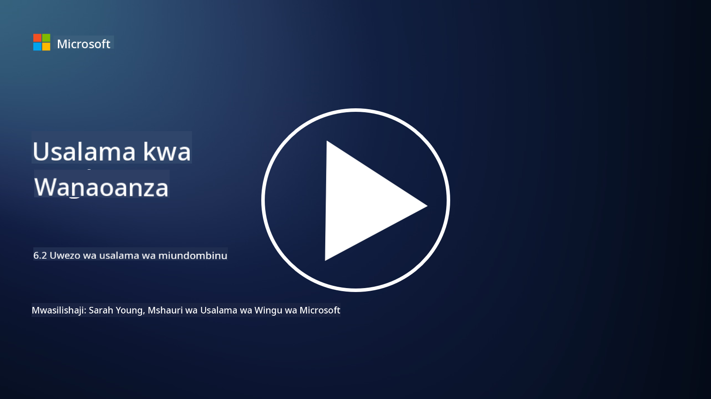

<!--
CO_OP_TRANSLATOR_METADATA:
{
  "original_hash": "7d79ba0e7668b3bdae1fba7aa047f6c0",
  "translation_date": "2025-09-04T00:15:26+00:00",
  "source_file": "6.2 Infrastructure security capabilities.md",
  "language_code": "sw"
}
-->
# Uwezo wa Usalama wa Miundombinu

Katika sehemu hii, tutajadili kwa undani zaidi kuhusu zana na uwezo wa msingi unaotumika katika usalama wa miundombinu.

**Utangulizi**

Katika somo hili, tutajadili:

- Usimamizi wa udhaifu ni nini?

- CSPM ni nini?

- CNAPP ni nini?

## Usimamizi wa udhaifu ni nini?

Usimamizi wa udhaifu ni mchakato wa kimfumo wa kutambua, kutathmini, kuweka vipaumbele, kupunguza, na kufuatilia udhaifu katika mifumo ya kompyuta, programu, mitandao, na miundombinu. Lengo kuu la usimamizi wa udhaifu ni kupunguza hatari za usalama kwa shirika kwa kushughulikia udhaifu unaojulikana kabla ya kutumiwa na wahusika wa uovu. Hapa kuna muhtasari wa hatua muhimu zinazohusika:

- **Utambuzi**: Kuchanganua na kugundua udhaifu katika mali za shirika, ambazo zinaweza kujumuisha seva, programu, vifaa vya mtandao, na vituo vya mwisho.

- **Tathmini**: Kutathmini ukali na athari inayoweza kutokea ya kila udhaifu kulingana na mambo kama alama ya Common Vulnerability Scoring System (CVSS) na muktadha wa biashara.

- **Kuweka vipaumbele**: Kuweka daraja udhaifu kulingana na kiwango cha hatari na athari inayoweza kutokea kwa shughuli na data za shirika.

- **Kupunguza**: Kuunda na kutekeleza mikakati ya kurekebisha au kupunguza udhaifu, ambayo inaweza kujumuisha kutumia viraka, kusanidi mipangilio ya usalama, au kupeleka udhibiti wa fidia.

- **Uthibitisho**: Kuhakikisha kwamba hatua za kupunguza zilikuwa na ufanisi katika kushughulikia udhaifu.

- **Ufuatiliaji wa Kuendelea**: Kufuatilia kwa mara kwa mara udhaifu na vitisho vinavyoweza kutokea, pamoja na uchanganuzi wa mara kwa mara wa udhaifu na tathmini.

Usimamizi wa udhaifu ni sehemu muhimu ya usalama wa mtandao, ikisaidia mashirika kudumisha hali ya usalama thabiti na kupunguza uwezekano wa uvunjaji wa usalama. Mifano ya zana za usimamizi wa udhaifu ni Defender for Cloud, Nessus, na Qualys.

## CSPM ni nini?

Usimamizi wa Msimamo wa Usalama wa Wingu (CSPM) ni seti ya zana, michakato, na mazoea yaliyoundwa kutathmini, kufuatilia, na kutekeleza usanidi wa usalama na mazoea bora katika mazingira ya wingu. Suluhisho za CSPM husaidia mashirika kutambua na kurekebisha usanidi mbaya, mapengo ya usalama, na ukiukaji wa kufuata katika miundombinu yao ya wingu, kama vile Amazon Web Services (AWS), Microsoft Azure, Google Cloud Platform (GCP), na watoa huduma wengine wa wingu.

Vipengele muhimu vya CSPM ni pamoja na:

- **Tathmini ya Usanidi**: Kuchanganua rasilimali na huduma za wingu ili kutambua usanidi mbaya, mipangilio isiyo salama, na mabadiliko kutoka kwa mazoea bora ya usalama.

- **Utekelezaji wa Sera za Usalama**: Kutekeleza sera za usalama na viwango vya kufuata katika mazingira ya wingu kwa kurekebisha usanidi mbaya moja kwa moja au kutoa arifa.

- **Ufuatiliaji wa Kuendelea**: Kutoa mwonekano wa kuendelea katika msimamo wa usalama wa mali na rasilimali za wingu, pamoja na arifa za wakati halisi kwa matukio ya usalama.

- **Ripoti za Ufuataji**: Kutengeneza ripoti na dashibodi kuonyesha kufuata mahitaji ya udhibiti na viwango vya sekta.

CSPM husaidia mashirika kuhakikisha kwamba miundombinu yao ya wingu ni salama, inakubaliana na viwango, na inalingana na mazoea bora, hivyo kupunguza hatari ya matukio ya usalama yanayohusiana na wingu. Mifano ya zana za CSPM ni Defender for Cloud na Snyk.

## CNAPP ni nini?

CNAPP inasimama kwa Jukwaa la Ulinzi wa Programu Asilia ya Wingu. Ni jukwaa la programu ya wingu asilia linalojumuisha kila kitu ambalo linarahisisha ufuatiliaji, kugundua, na kuchukua hatua dhidi ya vitisho vya usalama wa wingu na udhaifu. Linachanganya zana na uwezo mbalimbali katika suluhisho moja la programu ili kupunguza ugumu na kuwezesha operesheni za timu za DevOps na DevSecOps. CNAPP hutoa usalama wa wingu na programu kutoka mwanzo hadi mwisho katika mzunguko mzima wa maisha wa CI/CD wa programu, kuanzia maendeleo hadi uzalishaji. Linashughulikia hitaji la sekta la ufuatiliaji wa kisasa wa usalama wa wingu, usimamizi wa msimamo, kuzuia uvunjaji, na zana za udhibiti. Suluhisho za CNAPP hutoa timu za usalama uwezo wa kupima na kujibu hatari katika mazingira ya wingu. Baadhi ya vipengele vya CNAPP ni pamoja na mwonekano ulioboreshwa, upimaji wa hatari, maendeleo salama ya programu, na suluhisho la usalama wa wingu lililojumuishwa. CNAPP huunganisha zana mbalimbali za usalama wa wingu ambazo hapo awali zilikuwa zimegawanyika katika kiolesura kimoja cha mtumiaji, hivyo kurahisisha mashirika kulinda alama yao yote ya programu ya wingu. CNAPPs hujumuisha zana nyingi za usalama wa wingu asilia na vyanzo vya data, ikiwa ni pamoja na uchanganuzi wa kontena, usimamizi wa msimamo wa usalama wa wingu, uchanganuzi wa miundombinu kama msimbo, usimamizi wa haki za miundombinu ya wingu, na majukwaa ya ulinzi wa mzigo wa kazi wa wingu wakati wa kukimbia.

## Kusoma zaidi
- [What is CSPM? | Microsoft Security](https://www.microsoft.com/security/business/security-101/what-is-cspm?WT.mc_id=academic-96948-sayoung)
- [What is Cloud Security Posture Management (CSPM)? | HackerOne](https://www.hackerone.com/knowledge-center/what-cloud-security-posture-management)
- [Function of cloud security posture management - Cloud Adoption Framework | Microsoft Learn](https://learn.microsoft.com/azure/cloud-adoption-framework/organize/cloud-security-posture-management?WT.mc_id=academic-96948-sayoung)
- [What Is a CNAPP? | Microsoft Security](https://www.microsoft.com/security/business/security-101/what-is-cnapp?WT.mc_id=academic-96948-sayoung)
- [Why Everyone Is Talking About CNAPP (forbes.com)](https://www.forbes.com/sites/forbestechcouncil/2021/12/10/why-everyone-is-talking-about-cnapp/?sh=567275ca1549)
- [Improving Your Multi-Cloud Security with a Cloud-Native Application Protection Platform (CNAPP)](https://www.youtube.com/watch?v=5w42kQ_QjZg&t=212s)

---

**Kanusho**:  
Hati hii imetafsiriwa kwa kutumia huduma ya tafsiri ya AI [Co-op Translator](https://github.com/Azure/co-op-translator). Ingawa tunajitahidi kwa usahihi, tafadhali fahamu kuwa tafsiri za kiotomatiki zinaweza kuwa na makosa au kutokuwa sahihi. Hati ya asili katika lugha yake ya awali inapaswa kuzingatiwa kama chanzo cha mamlaka. Kwa taarifa muhimu, inashauriwa kutumia tafsiri ya kitaalamu ya binadamu. Hatutawajibika kwa maelewano mabaya au tafsiri zisizo sahihi zinazotokana na matumizi ya tafsiri hii.