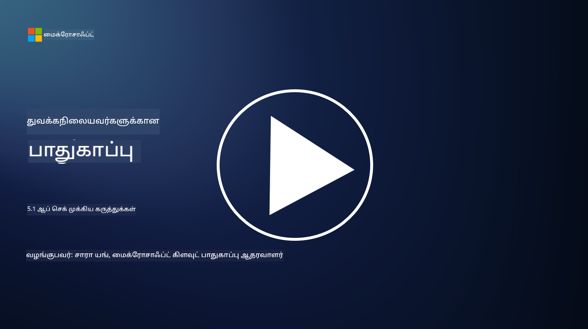

<!--
CO_OP_TRANSLATOR_METADATA:
{
  "original_hash": "e4b56bb23078d3ffb7ad407d280b0c36",
  "translation_date": "2025-10-11T11:24:04+00:00",
  "source_file": "5.1 AppSec key concepts.md",
  "language_code": "ta"
}
-->
# AppSec முக்கிய கருத்துக்கள்

பயன்பாட்டு பாதுகாப்பு என்பது தனித்துவமான பாதுகாப்பு துறையாகும். இந்த பாடத்தின் இந்த பகுதியில், பயன்பாட்டு பாதுகாப்பைப் பற்றி மேலும் அறிந்து கொள்வோம்.

## அறிமுகம்

இந்த பாடத்தில் நாம் கற்க இருப்பது:

- பயன்பாட்டு பாதுகாப்பு என்றால் என்ன?

- பயன்பாட்டு பாதுகாப்பின் முக்கிய கருத்துக்கள்/கொள்கைகள் என்ன?

## பயன்பாட்டு பாதுகாப்பு என்றால் என்ன?

பயன்பாட்டு பாதுகாப்பு, பொதுவாக "AppSec" என்று குறிக்கப்படுகிறது, மென்பொருள் பயன்பாடுகளை பாதுகாப்பு அச்சுறுத்தல்கள், பாதிப்புகள் மற்றும் தாக்குதல்களிலிருந்து பாதுகாக்கும் நடைமுறையை குறிக்கிறது. இது பயன்பாட்டின் மேம்பாடு, செயல்படுத்தல் மற்றும் பராமரிப்பு வாழ்க்கைச் சுழற்சியின் முழு காலத்திலும் பாதுகாப்பு அபாயங்களை அடையாளம் காண, குறைக்க மற்றும் தடுக்கும் செயல்முறைகள், நுட்பங்கள் மற்றும் கருவிகளை உள்ளடக்கியது.

பயன்பாட்டு பாதுகாப்பு முக்கியமானது, ஏனெனில் பயன்பாடுகள் சைபர் தாக்குதல்களுக்கு பொதுவான இலக்குகளாக உள்ளன. தீய நோக்கமுள்ள நபர்கள் மென்பொருளின் பாதிப்புகள் மற்றும் பலவீனங்களை பயன்படுத்தி அனுமதியற்ற அணுகலைப் பெற, தரவுகளை திருட, சேவைகளை பாதிக்க அல்லது பிற தீய செயல்பாடுகளைச் செய்ய முயற்சிக்கின்றனர். பயன்முறை பயன்பாட்டு பாதுகாப்பு, பயன்பாடு மற்றும் அதனுடன் தொடர்புடைய தரவின் ரகசியத்தன்மை, முழுமை மற்றும் கிடைக்கும்தன்மையை உறுதிசெய்கிறது.

## பயன்பாட்டு பாதுகாப்பின் முக்கிய கருத்துக்கள்/கொள்கைகள் என்ன?

பயன்பாட்டு பாதுகாப்பின் அடிப்படை கருத்துக்கள் மற்றும் கொள்கைகள் பின்வருமாறு:

1. **Secure by Design**:

- பாதுகாப்பு பயன்பாட்டின் வடிவமைப்பு மற்றும் கட்டமைப்பில் தொடக்கத்திலேயே ஒருங்கிணைக்கப்பட வேண்டும்; பின்னர் சேர்க்கப்படக்கூடாது.

2. **Input Validation**:

- அனைத்து பயனர் உள்ளீடுகளும் எதிர்பார்க்கப்படும் வடிவங்களுக்கு ஏற்ப உள்ளதா மற்றும் தீய நோக்கமுள்ள குறியீடு அல்லது தரவிலிருந்து விடுபட்டுள்ளதா என்பதை உறுதிசெய்ய வேண்டும்.

3. **Output Encoding**:

- வாடிக்கையாளருக்கு அனுப்பப்படும் தரவுகள் சரியாக குறியாக்கப்பட வேண்டும், இதனால் cross-site scripting (XSS) போன்ற பாதிப்புகள் தவிர்க்கப்படும்.

4. **Authentication and Authorization**:

- பயனர்களை அங்கீகரித்து, அவர்களின் பங்கு மற்றும் அனுமதிகளின் அடிப்படையில் வளங்களை அணுக அனுமதிக்க வேண்டும்.

5. **Data Protection**:

- உணர்வூட்டும் தரவுகள் சேமிக்கப்படும் போது, பரிமாறப்படும் போது மற்றும் செயலாக்கப்படும் போது குறியாக்கப்பட வேண்டும், இதனால் அனுமதியற்ற அணுகல் தவிர்க்கப்படும்.

6. **Session Management**:

- பாதுகாப்பான அமர்வு மேலாண்மை, பயனர் அமர்வுகளை கைப்பற்றுதல் மற்றும் அனுமதியற்ற அணுகலிலிருந்து பாதுகாக்கிறது.

7. **Secure Dependencies**:

- மென்பொருள் சார்புகளைப் பாதுகாப்பு புதுப்பிப்புகளுடன் புதுப்பித்து வைத்திருங்கள், இதனால் பாதிப்புகள் தவிர்க்கப்படும்.

8. **Error Handling and Logging**:

- உணர்வூட்டும் தகவல்களை வெளிப்படுத்தாமல் பாதுகாப்பான பிழை கையாளுதலை செயல்படுத்தவும், பாதுகாப்பான பதிவு நடைமுறைகளை உறுதிசெய்யவும்.

9. **Security Testing**:

- பயன்பாடுகளைப் பாதிப்புகளுக்காக வழக்கமாக சோதிக்கவும், உதாரணமாக penetration testing, code reviews மற்றும் தானியங்கி ஸ்கேனிங் கருவிகளைப் பயன்படுத்தவும்.

10. **Secure Software Development Lifecycle (SDLC)**:

- மென்பொருள் மேம்பாட்டு வாழ்க்கைச் சுழற்சியின் ஒவ்வொரு கட்டத்திலும், தேவைகளிலிருந்து செயல்படுத்தல் மற்றும் பராமரிப்பு வரை, பாதுகாப்பு நடைமுறைகளை ஒருங்கிணைக்கவும்.

## மேலும் படிக்க

- [SheHacksPurple: What is Application Security? - YouTube](https://www.youtube.com/watch?v=eNmccQNzSSY)
- [What Is Application Security? - Cisco](https://www.cisco.com/c/en/us/solutions/security/application-first-security/what-is-application-security.html#~how-does-it-work)
- [What is application security? A process and tools for securing software | CSO Online](https://www.csoonline.com/article/566471/what-is-application-security-a-process-and-tools-for-securing-software.html)
- [OWASP Cheat Sheet Series | OWASP Foundation](https://owasp.org/www-project-cheat-sheets/)

---

**குறிப்பு**:  
இந்த ஆவணம் [Co-op Translator](https://github.com/Azure/co-op-translator) என்ற AI மொழிபெயர்ப்பு சேவையைப் பயன்படுத்தி மொழிபெயர்க்கப்பட்டுள்ளது. நாங்கள் துல்லியத்திற்காக முயற்சிக்கிறோம், ஆனால் தானியக்க மொழிபெயர்ப்புகளில் பிழைகள் அல்லது தவறான தகவல்கள் இருக்கக்கூடும் என்பதை தயவுசெய்து கவனத்தில் கொள்ளுங்கள். அதன் தாய்மொழியில் உள்ள மூல ஆவணம் அதிகாரப்பூர்வ ஆதாரமாக கருதப்பட வேண்டும். முக்கியமான தகவல்களுக்கு, தொழில்முறை மனித மொழிபெயர்ப்பு பரிந்துரைக்கப்படுகிறது. இந்த மொழிபெயர்ப்பைப் பயன்படுத்துவதால் ஏற்படும் எந்த தவறான புரிதல்கள் அல்லது தவறான விளக்கங்களுக்கு நாங்கள் பொறுப்பல்ல.