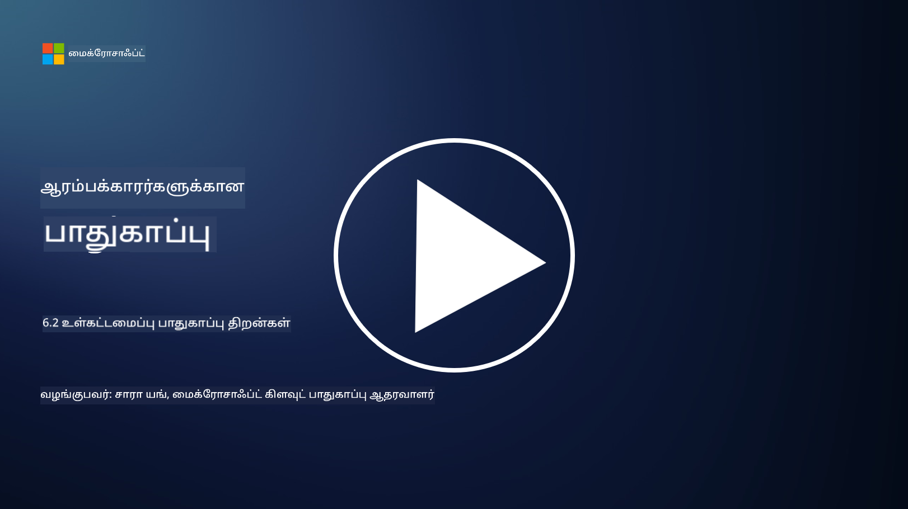

<!--
CO_OP_TRANSLATOR_METADATA:
{
  "original_hash": "7d79ba0e7668b3bdae1fba7aa047f6c0",
  "translation_date": "2025-10-11T11:17:48+00:00",
  "source_file": "6.2 Infrastructure security capabilities.md",
  "language_code": "ta"
}
-->
# உள்கட்டமைப்பு பாதுகாப்பு திறன்கள்

இந்த பிரிவில், உள்கட்டமைப்பு பாதுகாப்பில் பயன்படுத்தப்படும் முக்கிய கருவிகள் மற்றும் திறன்களைப் பற்றிய மேலும் விவரங்களை நாங்கள் ஆராய்வோம்.

**அறிமுகம்**

இந்த பாடத்தில், நாங்கள் ஆராய்வோம்:

- பாதிப்பு மேலாண்மை என்றால் என்ன?

- CSPM என்றால் என்ன?

- CNAPP என்றால் என்ன?

## பாதிப்பு மேலாண்மை என்றால் என்ன?

பாதிப்பு மேலாண்மை என்பது கணினி அமைப்புகள், மென்பொருள், நெட்வொர்க்கள் மற்றும் உள்கட்டமைப்புகளில் உள்ள பாதிப்புகளை அடையாளம் காணும், மதிப்பீடு செய்யும், முன்னுரிமை அளிக்கும், குறைக்கும் மற்றும் கண்காணிக்கும் ஒரு முறையான செயல்முறையாகும். பாதிப்பு மேலாண்மையின் முதன்மை நோக்கம், தீய நோக்கத்துடன் செயல்படும் நபர்களால் பயன்படுத்தப்படுவதற்கு முன் அறியப்பட்ட பாதிப்புகளை முன்கூட்டியே சரிசெய்து, ஒரு நிறுவனத்தின் பாதுகாப்பு அபாயங்களை குறைப்பதாகும். இதோ முக்கியமான படிகளின் சுருக்கம்:

அடையாளம் காணுதல்: நிறுவனத்தின் சொத்துக்களில் உள்ள பாதிப்புகளை ஸ்கேன் செய்து கண்டறிதல். இதில் சர்வர்கள், பயன்பாடுகள், நெட்வொர்க் சாதனங்கள் மற்றும் எண்ட்பாயிண்ட்கள் அடங்கும்.

மதிப்பீடு: Common Vulnerability Scoring System (CVSS) மதிப்பெண் மற்றும் வணிக சூழல் போன்ற காரணிகளை அடிப்படையாகக் கொண்டு ஒவ்வொரு பாதிப்பின் தீவிரத்தையும், தாக்கத்தையும் மதிப்பீடு செய்தல்.

முன்னுரிமை: பாதிப்புகளை அதன் அபாய நிலை மற்றும் நிறுவனத்தின் செயல்பாடுகள் மற்றும் தரவுகளுக்கு ஏற்ப ஏற்படும் தாக்கத்தின் அடிப்படையில் வரிசைப்படுத்துதல்.

குறைத்தல்: பாச்சுகள் பயன்படுத்துதல், பாதுகாப்பு அமைப்புகளைச் சரிசெய்தல் அல்லது மாற்று கட்டுப்பாடுகளைப் பயன்படுத்துதல் போன்ற உத்திகளை உருவாக்கி செயல்படுத்துதல்.

உறுதிப்படுத்தல்: பாதிப்புகளை சரிசெய்யும் நடவடிக்கைகள் பயனுள்ளதாக இருந்ததா என்பதை உறுதிப்படுத்துதல்.

தொடர்ச்சியான கண்காணிப்பு: பாதிப்புகள் மற்றும் சாத்தியமான அச்சுறுத்தல்களை தொடர்ந்து கண்காணித்தல், மற்றும் வழக்கமான பாதிப்பு ஸ்கேன்கள் மற்றும் மதிப்பீடுகள்.

பாதிப்பு மேலாண்மை என்பது சைபர் பாதுகாப்பின் முக்கியமான கூறாகும், இது நிறுவனங்களுக்கு வலுவான பாதுகாப்பு நிலையை பராமரிக்கவும், பாதுகாப்பு மீறல்களின் சாத்தியத்தை குறைக்கவும் உதவுகிறது. பாதிப்பு மேலாண்மை கருவிகளின் உதாரணங்கள் Defender for Cloud, Nessus மற்றும் Qualys ஆகும்.

## CSPM என்றால் என்ன?

Cloud Security Posture Management (CSPM) என்பது மேக சூழல்களில் பாதுகாப்பு அமைப்புகள் மற்றும் சிறந்த நடைமுறைகளை மதிப்பீடு செய்ய, கண்காணிக்க மற்றும் அமல்படுத்த வடிவமைக்கப்பட்ட கருவிகள், செயல்முறைகள் மற்றும் நடைமுறைகளின் தொகுப்பாகும். CSPM தீர்வுகள், Amazon Web Services (AWS), Microsoft Azure, Google Cloud Platform (GCP) மற்றும் பிற மேக வழங்குநர்களில் உள்ள மேக உள்கட்டமைப்பில் உள்ள தவறான அமைப்புகள், பாதுகாப்பு இடைவெளிகள் மற்றும் இணக்கமின்மை மீறல்களை கண்டறிந்து சரிசெய்ய உதவுகிறது.

CSPM இன் முக்கிய அம்சங்கள்:

- அமைப்பு மதிப்பீடு: மேக வளங்கள் மற்றும் சேவைகளை ஸ்கேன் செய்து தவறான அமைப்புகள், பாதுகாப்பற்ற அமைப்புகள் மற்றும் சிறந்த நடைமுறைகளிலிருந்து விலகல்களை கண்டறிதல்.

- பாதுகாப்பு கொள்கை அமலாக்கம்: மேக சூழல்களில் பாதுகாப்பு கொள்கைகள் மற்றும் இணக்கத்தன்மை தரநிலைகளை அமல்படுத்துதல், தவறான அமைப்புகளை தானாக சரிசெய்தல் அல்லது எச்சரிக்கைகளை உருவாக்குதல்.

- தொடர்ச்சியான கண்காணிப்பு: மேக சொத்துகள் மற்றும் வளங்களின் பாதுகாப்பு நிலையை தொடர்ந்து கண்காணித்து, பாதுகாப்பு சம்பவங்களுக்கு நேரடி எச்சரிக்கைகளை வழங்குதல்.

- இணக்கத்தன்மை அறிக்கைகள்: ஒழுங்குமுறை தேவைகள் மற்றும் தொழில்துறை தரநிலைகளுடன் இணக்கத்தன்மையை நிரூபிக்க அறிக்கைகள் மற்றும் டாஷ்போர்டுகளை உருவாக்குதல்.

CSPM நிறுவனங்களுக்கு மேக உள்கட்டமைப்பு பாதுகாப்பானது, இணக்கமானது மற்றும் சிறந்த நடைமுறைகளுடன் ஒத்துப்போகும் என்பதை உறுதிசெய்ய உதவுகிறது, மேக தொடர்பான பாதுகாப்பு சம்பவங்களின் அபாயத்தை குறைக்கிறது. CSPM கருவிகளின் உதாரணங்கள் Defender for Cloud மற்றும் Snyk ஆகும்.

## CNAPP என்றால் என்ன?

CNAPP என்பது Cloud-Native Application Protection Platform என்பதற்கான சுருக்கமாகும். இது மேக பாதுகாப்பு அச்சுறுத்தல்கள் மற்றும் பாதிப்புகளை கண்காணிக்க, கண்டறிய மற்றும் நடவடிக்கை எடுக்க எளிதாக்கும் ஒரு ஒருங்கிணைந்த மேக-நேச மென்பொருள் தளமாகும். இது பல கருவிகள் மற்றும் திறன்களை ஒரே மென்பொருள் தீர்வில் இணைத்து, DevOps மற்றும் DevSecOps குழுக்களின் செயல்பாடுகளை எளிதாக்குகிறது. CNAPP, மேக மற்றும் பயன்பாட்டு பாதுகாப்பை முழு CI/CD பயன்பாட்டு வாழ்க்கைச் சுழற்சியில், உருவாக்கத்திலிருந்து உற்பத்தி வரை வழங்குகிறது. இது மேக பாதுகாப்பு கண்காணிப்பு, நிலை மேலாண்மை, மீறல் தடுப்பு மற்றும் கட்டுப்பாட்டு கருவிகளுக்கான தொழில்துறை தேவையை தீர்க்கிறது. CNAPP தீர்வுகள் பாதுகாப்பு குழுக்களுக்கு மேக சூழலில் அபாயங்களை அளவிடவும், பதிலளிக்கவும் திறனை வழங்குகிறது. CNAPP இன் சில அம்சங்கள் மேம்பட்ட காட்சி, அபாயங்களை அளவிடுதல், பாதுகாப்பான மென்பொருள் உருவாக்கம் மற்றும் ஒருங்கிணைந்த மேக பாதுகாப்பு தீர்வுகளை உள்ளடக்கியவை. CNAPP, பாரம்பரியமாக தனித்தனியாக இருந்த பல மேக-நேச பாதுகாப்பு கருவிகள் மற்றும் தரவுத் தரவுகளை ஒரே பயனர் இடைமுகத்தில் ஒருங்கிணைக்கிறது, நிறுவனங்களுக்கு அவர்களின் முழு மேக பயன்பாட்டு அடையாளத்தை பாதுகாக்க எளிதாக்குகிறது. CNAPP-கள், கொண்டெய்னர் ஸ்கேனிங், மேக பாதுகாப்பு நிலை மேலாண்மை, கோடாக் கட்டமைப்பு ஸ்கேனிங், மேக உள்கட்டமைப்பு உரிமைகள் மேலாண்மை மற்றும் ரன்டைம் மேக வேலைப்பாடுகள் பாதுகாப்பு தளங்களை ஒருங்கிணைக்கின்றன.

## மேலும் படிக்க
- [CSPM என்றால் என்ன? | Microsoft Security](https://www.microsoft.com/security/business/security-101/what-is-cspm?WT.mc_id=academic-96948-sayoung)
- [Cloud Security Posture Management (CSPM) என்றால் என்ன? | HackerOne](https://www.hackerone.com/knowledge-center/what-cloud-security-posture-management)
- [மேக பாதுகாப்பு நிலை மேலாண்மையின் செயல்பாடு - Cloud Adoption Framework | Microsoft Learn](https://learn.microsoft.com/azure/cloud-adoption-framework/organize/cloud-security-posture-management?WT.mc_id=academic-96948-sayoung)
- [CNAPP என்றால் என்ன? | Microsoft Security](https://www.microsoft.com/security/business/security-101/what-is-cnapp?WT.mc_id=academic-96948-sayoung)
- [ஏன் அனைவரும் CNAPP பற்றி பேசுகிறார்கள் (forbes.com)](https://www.forbes.com/sites/forbestechcouncil/2021/12/10/why-everyone-is-talking-about-cnapp/?sh=567275ca1549)
- [Cloud-Native Application Protection Platform (CNAPP) மூலம் உங்கள் பல-மேக பாதுகாப்பை மேம்படுத்துதல்](https://www.youtube.com/watch?v=5w42kQ_QjZg&t=212s)

---

**குறிப்பு**:  
இந்த ஆவணம் [Co-op Translator](https://github.com/Azure/co-op-translator) என்ற AI மொழிபெயர்ப்பு சேவையைப் பயன்படுத்தி மொழிபெயர்க்கப்பட்டுள்ளது. நாங்கள் துல்லியத்திற்காக முயற்சிக்கின்றோம், ஆனால் தானியங்கி மொழிபெயர்ப்புகளில் பிழைகள் அல்லது தவறான தகவல்கள் இருக்கக்கூடும் என்பதை தயவுசெய்து கவனத்தில் கொள்ளுங்கள். அதன் தாய்மொழியில் உள்ள மூல ஆவணம் அதிகாரப்பூர்வ ஆதாரமாக கருதப்பட வேண்டும். முக்கியமான தகவல்களுக்கு, தொழில்முறை மனித மொழிபெயர்ப்பு பரிந்துரைக்கப்படுகிறது. இந்த மொழிபெயர்ப்பைப் பயன்படுத்துவதால் ஏற்படும் எந்த தவறான புரிதல்கள் அல்லது தவறான விளக்கங்களுக்கு நாங்கள் பொறுப்பல்ல.