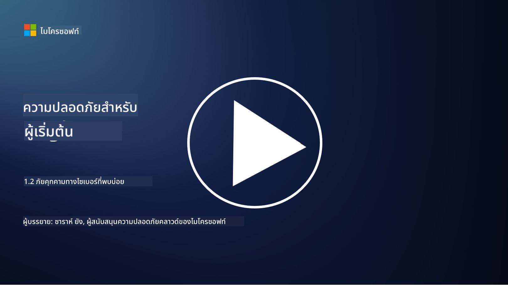

<!--
CO_OP_TRANSLATOR_METADATA:
{
  "original_hash": "6fc3030323139d7134a4ca9d03eccac9",
  "translation_date": "2025-09-03T23:24:04+00:00",
  "source_file": "1.2 Common cybersecurity threats.md",
  "language_code": "th"
}
-->
# ภัยคุกคามทางไซเบอร์ที่พบบ่อย

## บทนำ

ในบทเรียนนี้ เราจะพูดถึง:

- ภัยคุกคามทางไซเบอร์คืออะไร?

- ทำไมผู้ไม่หวังดีถึงต้องการโจมตีข้อมูลและระบบไอที?

- ประเภทของภัยคุกคามทางไซเบอร์ที่พบบ่อยที่สุดคืออะไร?

- กรอบการทำงาน MITRE ATT&CK คืออะไร?

- เราจะติดตามสถานการณ์ภัยคุกคามทางไซเบอร์ได้จากที่ไหน?

## ภัยคุกคามทางไซเบอร์คืออะไร?

ภัยคุกคามทางไซเบอร์หมายถึงความเสี่ยงหรืออันตรายที่อาจเกิดขึ้นซึ่งสามารถส่งผลกระทบต่อความลับ ความถูกต้อง หรือความพร้อมใช้งานของข้อมูลหรือระบบไอที ภัยคุกคามเหล่านี้เกิดจากผู้ไม่หวังดีที่พยายามใช้ช่องโหว่เพื่อเข้าถึงข้อมูลโดยไม่ได้รับอนุญาต ขโมยข้อมูลสำคัญ ขัดขวางการดำเนินงาน หรือสร้างความเสียหายต่อบุคคล องค์กร หรือแม้กระทั่งประเทศ ภัยคุกคามทางไซเบอร์มีหลายรูปแบบและสามารถโจมตีส่วนต่าง ๆ ของระบบดิจิทัลและข้อมูลได้

## ทำไมผู้ไม่หวังดีถึงต้องการโจมตีข้อมูลและระบบไอที?

ผู้ไม่หวังดีโจมตีข้อมูลและระบบไอทีด้วยเหตุผลหลากหลาย โดยมักมีแรงจูงใจจากผลประโยชน์ส่วนตัว อุดมการณ์ หรือความต้องการสร้างความเสียหาย การเข้าใจแรงจูงใจเหล่านี้สามารถช่วยให้องค์กรและบุคคลป้องกันภัยคุกคามทางไซเบอร์ได้ดียิ่งขึ้น เหตุผลทั่วไปที่ผู้ไม่หวังดีโจมตีทางไซเบอร์ ได้แก่:

1. **ผลประโยชน์ทางการเงิน**: การโจมตีหลายครั้งมีเป้าหมายเพื่อผลกำไรทางการเงิน ผู้ไม่หวังดีอาจขโมยข้อมูลสำคัญ เช่น หมายเลขบัตรเครดิต รายละเอียดบัญชีธนาคาร หรือข้อมูลส่วนตัวเพื่อก่ออาชญากรรม การขโมยตัวตน เรียกค่าไถ่ หรือขายข้อมูลที่ขโมยมาในตลาดมืด

2. **การจารกรรม**: รัฐบาล คู่แข่ง หรือหน่วยงานอื่น ๆ อาจมีส่วนร่วมในการจารกรรมทางไซเบอร์เพื่อขโมยข้อมูลสำคัญของรัฐบาล บริษัท หรือการวิจัยเพื่อผลประโยชน์ทางการเมือง เศรษฐกิจ หรือการทหาร

3. **การขัดขวางและการก่อวินาศกรรม**: การโจมตีบางครั้งมีเป้าหมายเพื่อขัดขวางโครงสร้างพื้นฐานที่สำคัญ บริการ หรือการดำเนินงานด้วยเหตุผลทางการเมืองหรืออุดมการณ์ การโจมตีเหล่านี้สามารถสร้างความวุ่นวายอย่างกว้างขวาง ความสูญเสียทางการเงิน และความเสียหายต่อชื่อเสียง

4. **แรงจูงใจทางอุดมการณ์**: กลุ่มแฮกเกอร์ที่มีอุดมการณ์หรือแรงจูงใจทางการเมืองอาจโจมตีระบบเพื่อสร้างความตระหนักในประเด็นต่าง ๆ ส่งเสริมความเชื่อของพวกเขา หรือประท้วงต่อการกระทำหรือองค์กรบางแห่ง

5. **การกระทำโดยไม่ตั้งใจ**: ไม่ใช่ทุกการกระทำที่เป็นภัยคุกคามจะเกิดขึ้นโดยเจตนา บางคนอาจมีส่วนร่วมในภัยคุกคามทางไซเบอร์โดยไม่รู้ตัว เช่น การตกเป็นเหยื่อของการหลอกลวงทางสังคม หรือการเป็นส่วนหนึ่งของเครือข่ายที่ถูกโจมตี

ท้ายที่สุด แรงจูงใจในการโจมตีข้อมูลและระบบไอทีมีความหลากหลาย และผลกระทบของการโจมตีเหล่านี้อาจรุนแรง การให้ความสำคัญกับความปลอดภัยทางไซเบอร์และการดำเนินมาตรการป้องกันภัยคุกคามเหล่านี้จึงเป็นสิ่งสำคัญสำหรับบุคคล องค์กร และรัฐบาล

## ประเภทของภัยคุกคามทางไซเบอร์ที่พบบ่อยที่สุดคืออะไร?

มีการโจมตีทางไซเบอร์หลายประเภทที่ผู้ไม่หวังดีใช้เพื่อโจมตีระบบ ขโมยข้อมูล และสร้างความเสียหาย ต่อไปนี้คือประเภทที่พบบ่อยที่สุดในขณะนี้:

1. **ฟิชชิง (Phishing)**:

ฟิชชิงเกี่ยวข้องกับการส่งอีเมลหรือข้อความหลอกลวงที่ดูเหมือนมาจากแหล่งที่น่าเชื่อถือเพื่อหลอกล่อให้ผู้รับเปิดเผยข้อมูลสำคัญ เช่น รหัสผ่าน หมายเลขบัตรเครดิต หรือข้อมูลส่วนตัว ฟิชชิงยังสามารถนำเหยื่อไปยังเว็บไซต์ที่เป็นอันตรายหรือดาวน์โหลดมัลแวร์ได้

2. **มัลแวร์ (Malware)**:

มัลแวร์ (ซอฟต์แวร์ที่เป็นอันตราย) ครอบคลุมโปรแกรมที่เป็นอันตรายหลากหลายประเภทที่ออกแบบมาเพื่อโจมตีระบบ ขโมยข้อมูล หรือสร้างความเสียหาย ประเภทของมัลแวร์ ได้แก่:

- **แรนซัมแวร์ (Ransomware)**: เข้ารหัสไฟล์และเรียกค่าไถ่เพื่อปลดล็อกไฟล์

- **โทรจัน (Trojans)**: ปลอมตัวเป็นซอฟต์แวร์ที่ถูกต้องเพื่อให้ผู้โจมตีเข้าถึงโดยไม่ได้รับอนุญาต

- **ไวรัส (Viruses)**: โปรแกรมที่สามารถแพร่กระจายตัวเองโดยแนบไปกับไฟล์

- **เวิร์ม (Worms)**: โปรแกรมที่สามารถแพร่กระจายตัวเองผ่านเครือข่าย

3. **การโจมตีแบบปฏิเสธการให้บริการ (DoS) และการโจมตีแบบปฏิเสธการให้บริการแบบกระจาย (DDoS)**:

การโจมตีแบบ DoS จะทำให้ระบบเป้าหมายทำงานหนักเกินไปจนไม่สามารถให้บริการแก่ผู้ใช้ได้ การโจมตีแบบ DDoS ใช้เครือข่ายของอุปกรณ์ที่ถูกโจมตีเพื่อส่งข้อมูลจำนวนมากไปยังเป้าหมาย ทำให้ระบบทำงานไม่ปกติหรือหยุดทำงานโดยสิ้นเชิง

4. **SQL Injection**:

การโจมตีนี้เกี่ยวข้องกับการที่ผู้โจมตีปรับเปลี่ยนช่องป้อนข้อมูลของแอปพลิเคชันเว็บเพื่อฉีดคำสั่ง SQL ที่เป็นอันตราย ซึ่งอาจทำให้เข้าถึงฐานข้อมูลและข้อมูลสำคัญโดยไม่ได้รับอนุญาต

5. **Cross-Site Scripting (XSS)**:

ผู้โจมตีฉีดสคริปต์ที่เป็นอันตรายเข้าไปในแอปพลิเคชันเว็บ ซึ่งจะถูกดำเนินการโดยเบราว์เซอร์ของผู้ใช้ที่ไม่สงสัย การโจมตีนี้สามารถนำไปสู่การขโมยข้อมูลผู้ใช้หรือการแพร่กระจายมัลแวร์

6. **การหลอกลวงทางสังคม (Social Engineering)**:

การหลอกลวงทางสังคมใช้จิตวิทยาเพื่อหลอกล่อให้บุคคลเปิดเผยข้อมูลลับหรือดำเนินการที่ทำให้เกิดความเสี่ยงต่อความปลอดภัย

7. **Zero-Day (0day) Exploits**:

การโจมตีเหล่านี้มุ่งเป้าช่องโหว่ในซอฟต์แวร์หรือฮาร์ดแวร์ที่ยังไม่เป็นที่รู้จักของผู้พัฒนาหรือสาธารณะ ผู้โจมตีใช้ประโยชน์จากช่องโหว่เหล่านี้ก่อนที่จะมีการพัฒนาแพตช์ แม้ว่าองค์กรหลายแห่งจะกังวลเกี่ยวกับ Zero-Day แต่การโจมตีเหล่านี้ไม่พบบ่อยเท่าการโจมตีประเภทอื่นในรายการนี้ เมื่อมีการค้นพบ Zero-Day นักวิจัยด้านความปลอดภัยจะเร่งพัฒนาแพตช์ และโดยทั่วไป Zero-Day จะมีอายุสั้น

8. **การโจมตีข้อมูลรับรอง (Credential Attacks)**:

การโจมตีเหล่านี้รวมถึงการโจมตีแบบเดาสุ่มรหัสผ่าน (Brute Force) ซึ่งผู้โจมตีเดารหัสผ่านซ้ำ ๆ และการโจมตีแบบ Credential Stuffing ซึ่งใช้ข้อมูลรับรองที่ถูกขโมยจากเว็บไซต์หนึ่งเพื่อพยายามเข้าถึงเว็บไซต์อื่น

## กรอบการทำงาน MITRE ATT&CK คืออะไร?

[กรอบการทำงาน MITRE ATT&CK](https://attack.mitre.org/) (Adversarial Tactics, Techniques, and Common Knowledge) เป็นกรอบการทำงานที่รวบรวมและจัดหมวดหมู่กลยุทธ์ เทคนิค และกระบวนการ (TTPs) ที่ผู้โจมตีใช้ในระหว่างการโจมตีทางไซเบอร์ กรอบการทำงานนี้ถูกสร้างขึ้นโดย MITRE Corporation ซึ่งเป็นองค์กรไม่แสวงหาผลกำไรที่ดำเนินการศูนย์วิจัยและพัฒนาสำหรับหน่วยงานรัฐบาลต่าง ๆ

กรอบการทำงาน MITRE ATT&CK ให้วิธีการมาตรฐานในการอธิบายและวิเคราะห์ภัยคุกคามทางไซเบอร์ ช่วยให้ผู้เชี่ยวชาญด้านความปลอดภัยทางไซเบอร์เข้าใจและป้องกันเทคนิคการโจมตีต่าง ๆ ได้ดียิ่งขึ้น กรอบการทำงานนี้ถูกใช้อย่างแพร่หลายโดยทีมรักษาความปลอดภัย นักล่าภัยคุกคาม และผู้ตอบสนองเหตุการณ์เพื่อ:

1. **เข้าใจพฤติกรรมของผู้โจมตี**: กรอบการทำงานนี้บันทึกพฤติกรรมการโจมตีในโลกจริง โดยอธิบายขั้นตอนที่ผู้โจมตีดำเนินการตั้งแต่การเข้าถึงครั้งแรกจนถึงการบรรลุเป้าหมาย ครอบคลุมเทคนิคการโจมตีที่หลากหลายที่กลุ่มภัยคุกคามต่าง ๆ ใช้

2. **วางแผนและดำเนินกลยุทธ์การป้องกัน**: ทีมรักษาความปลอดภัยสามารถใช้กรอบการทำงานนี้เพื่อพัฒนากลยุทธ์การป้องกันเชิงรุกที่สอดคล้องกับกลยุทธ์และเทคนิคเฉพาะที่ผู้โจมตีอาจใช้

3. **การตอบสนองเหตุการณ์และการล่าภัยคุกคาม**: เมื่อสืบสวนเหตุการณ์หรือดำเนินการล่าภัยคุกคาม ผู้เชี่ยวชาญด้านความปลอดภัยสามารถอ้างอิงกรอบการทำงานเพื่อระบุและลดผลกระทบของเทคนิคเฉพาะที่ผู้โจมตีใช้

กรอบการทำงาน MITRE ATT&CK ถูกจัดเป็นเมทริกซ์ที่จัดกลุ่มเทคนิคการโจมตีตามแพลตฟอร์มและสภาพแวดล้อมเฉพาะ เช่น Windows, macOS, Linux และบริการคลาวด์ แต่ละเมทริกซ์แบ่งออกเป็นกลยุทธ์ (เป้าหมายระดับสูง) และเทคนิค (วิธีการเฉพาะที่ใช้เพื่อบรรลุเป้าหมาย) สำหรับแต่ละเทคนิค กรอบการทำงานให้ข้อมูลเกี่ยวกับวิธีการทำงาน วิธีการลดผลกระทบ และข้อมูลอ้างอิงที่เกี่ยวข้องกับกลุ่มภัยคุกคามในโลกจริงที่เคยใช้เทคนิคนี้

กรอบการทำงานนี้ได้รับการอัปเดตและขยายอย่างต่อเนื่องเมื่อมีการรวบรวมข้อมูลภัยคุกคามใหม่ ๆ และเมื่อสถานการณ์ภัยคุกคามทางไซเบอร์เปลี่ยนแปลงไป เป็นทรัพยากรที่มีคุณค่าสำหรับการเสริมสร้างความปลอดภัยทางไซเบอร์ขององค์กรโดยช่วยให้เข้าใจวิธีการที่ผู้โจมตีใช้และวิธีการป้องกันกลยุทธ์ของพวกเขา

## เราจะติดตามสถานการณ์ภัยคุกคามทางไซเบอร์ได้จากที่ไหน?

มีแหล่งข้อมูลมากมายที่สามารถใช้ติดตามภัยคุกคามทางไซเบอร์ ต่อไปนี้คือบางส่วน:

- [Open Web Application Security Project (OWASP) top 10 vulnerabilities](https://owasp.org/Top10/)
- [Common Vulnerabilities and Exposures (CVEs)](https://www.bing.com/ck/a?!&&p=53df6007f017bca2JmltdHM9MTY5MjU3NjAwMCZpZ3VpZD0zYmY4N2RiYS1jYWI1LTYwMDgtMWY1YS02ZmYyY2JjNjYxZWUmaW5zaWQ9NTc2OQ&ptn=3&hsh=3&fclid=3bf87dba-cab5-6008-1f5a-6ff2cbc661ee&psq=cve&u=a1aHR0cHM6Ly9iaW5nLmNvbS9hbGluay9saW5rP3VybD1odHRwcyUzYSUyZiUyZmN2ZS5taXRyZS5vcmclMmYmc291cmNlPXNlcnAtcnImaD1BZXN4S0VBWTNnbGhNZEFpd3daMlNSZkZQNTlrODhIUnYxRUtlSkY1RTk0JTNkJnA9a2NvZmZjaWFsd2Vic2l0ZQ&ntb=1 "Common Vulnerabilities and Exposures")
- [Microsoft Security Response Center blogs](https://msrc.microsoft.com/blog/)
- [National Institute of Standards and Technology (NIST)](https://www.dhs.gov/topics/cybersecurity): NIST ให้ทรัพยากร การแจ้งเตือน และการอัปเดตล่าสุดเกี่ยวกับภัยคุกคามทางไซเบอร์ที่อาจเกิดขึ้น
- [Cybersecurity and Infrastructure Security Agency (CISA)](https://www.cisa.gov/resources-tools/resources/free-cybersecurity-services-and-tools): CISA ให้ทรัพยากรด้านความปลอดภัยทางไซเบอร์และแนวปฏิบัติที่ดีที่สุดสำหรับธุรกิจ หน่วยงานรัฐบาล และองค์กรอื่น ๆ CISA แบ่งปันข้อมูลล่าสุดเกี่ยวกับกิจกรรมด้านความปลอดภัยที่มีผลกระทบสูงที่ส่งผลต่อชุมชนโดยรวม และการวิเคราะห์เชิงลึกเกี่ยวกับภัยคุกคามทางไซเบอร์ใหม่ ๆ และที่กำลังพัฒนา
- [National Cybersecurity Center of Excellence (NCCoE)](https://www.dhs.gov/topics/cybersecurity): NCCoE เป็นศูนย์ที่ให้โซลูชันด้านความปลอดภัยทางไซเบอร์ที่สามารถนำไปใช้ในสถานการณ์จริง
- [US-CERT](https://www.cisa.gov/resources-tools/resources/free-cybersecurity-services-and-tools): ทีมตอบสนองเหตุการณ์ทางคอมพิวเตอร์ของสหรัฐอเมริกา (US-CERT) ให้ทรัพยากรด้านความปลอดภัยทางไซเบอร์หลากหลาย รวมถึงการแจ้งเตือน เคล็ดลับ และอื่น ๆ
- ทีมตอบสนองเหตุการณ์ทางไซเบอร์ (CERT) ของประเทศของคุณ

---

**ข้อจำกัดความรับผิดชอบ**:  
เอกสารนี้ได้รับการแปลโดยใช้บริการแปลภาษา AI [Co-op Translator](https://github.com/Azure/co-op-translator) แม้ว่าเราจะพยายามให้การแปลมีความถูกต้อง แต่โปรดทราบว่าการแปลโดยอัตโนมัติอาจมีข้อผิดพลาดหรือความไม่ถูกต้อง เอกสารต้นฉบับในภาษาดั้งเดิมควรถือเป็นแหล่งข้อมูลที่เชื่อถือได้ สำหรับข้อมูลที่สำคัญ ขอแนะนำให้ใช้บริการแปลภาษามืออาชีพ เราไม่รับผิดชอบต่อความเข้าใจผิดหรือการตีความผิดที่เกิดจากการใช้การแปลนี้