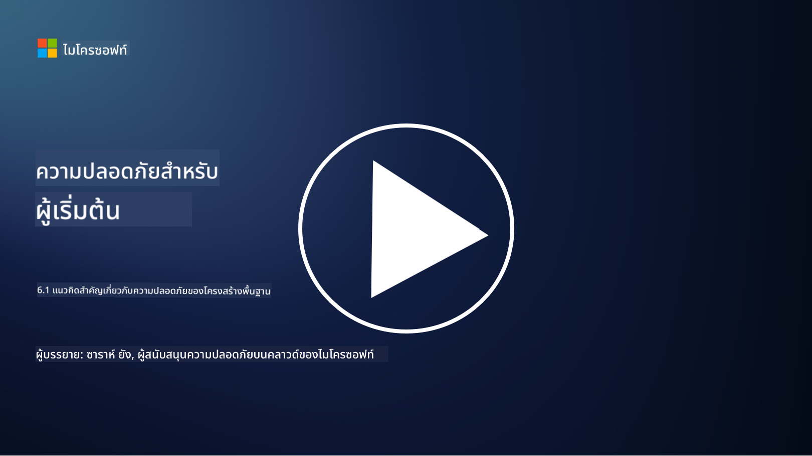

<!--
CO_OP_TRANSLATOR_METADATA:
{
  "original_hash": "882ebf66a648f419bcbf680ed6aefa00",
  "translation_date": "2025-09-03T23:13:34+00:00",
  "source_file": "6.1 Infrastructure security key concepts.md",
  "language_code": "th"
}
-->
# แนวคิดสำคัญเกี่ยวกับความปลอดภัยของโครงสร้างพื้นฐาน

“โครงสร้างพื้นฐาน” หมายถึงองค์ประกอบพื้นฐานของสภาพแวดล้อมไอทีใดๆ ซึ่งรวมถึงเซิร์ฟเวอร์ บริการคลาวด์ และคอนเทนเนอร์ – เทคโนโลยีหลากหลายประเภท แอปพลิเคชันที่กล่าวถึงในส่วนก่อนหน้านี้ทำงานบนโครงสร้างพื้นฐาน ดังนั้นโครงสร้างพื้นฐานจึงสามารถตกเป็นเป้าหมายของผู้โจมตีได้เช่นกัน

ในบทเรียนนี้ เราจะพูดถึง:

- ความสำคัญของการดูแลความปลอดภัยคืออะไร?

- การจัดการท่าทีความปลอดภัยคืออะไร?

- การอัปเดตแพตช์คืออะไรและทำไมถึงสำคัญ?

- คอนเทนเนอร์คืออะไรและความปลอดภัยของมันแตกต่างอย่างไร?

## ความสำคัญของการดูแลความปลอดภัยคืออะไร?

**การดูแลความปลอดภัย** หมายถึงชุดของแนวปฏิบัติและพฤติกรรมที่บุคคลและองค์กรปฏิบัติตามเพื่อรักษานิสัยที่ดีในด้านความปลอดภัยทางไซเบอร์ ซึ่งเกี่ยวข้องกับการดำเนินการเพื่อปกป้องระบบ ข้อมูล และเครือข่ายจากภัยคุกคามและช่องโหว่ การดูแลความปลอดภัยที่ดีมีความสำคัญด้วยเหตุผลหลายประการ:

- **ป้องกันการโจมตี**: การปฏิบัติตามแนวทางที่ดีที่สุดสามารถป้องกันการโจมตีทางไซเบอร์ทั่วไป เช่น ฟิชชิง การติดมัลแวร์ และการเข้าถึงโดยไม่ได้รับอนุญาต

- **ปกป้องข้อมูล**: การดูแลความปลอดภัยที่เหมาะสมช่วยปกป้องข้อมูลที่ละเอียดอ่อนและเป็นความลับจากการถูกขโมยหรือเปิดเผย

- **สร้างความไว้วางใจ**: องค์กรที่แสดงให้เห็นถึงการดูแลความปลอดภัยที่ดีจะสร้างความไว้วางใจให้กับลูกค้าและพันธมิตร

- **การปฏิบัติตามข้อกำหนด**: กฎระเบียบและมาตรฐานหลายข้อกำหนดให้องค์กรปฏิบัติตามแนวทางการดูแลความปลอดภัย

- **ลดความเสี่ยง**: การดูแลความปลอดภัยอย่างสม่ำเสมอช่วยลดความเสี่ยงโดยรวมของเหตุการณ์และการละเมิดความปลอดภัย

การดูแลความปลอดภัยรวมถึงแนวปฏิบัติเช่น การอัปเดตซอฟต์แวร์ให้ทันสมัย การใช้รหัสผ่านที่แข็งแรงและการยืนยันตัวตนแบบหลายปัจจัย การสำรองข้อมูลเป็นประจำ การฝึกอบรมพนักงาน และการตรวจสอบกิจกรรมที่น่าสงสัย สิ่งเหล่านี้เป็นพื้นฐานของท่าทีความปลอดภัยทางไซเบอร์ที่แข็งแกร่ง

## การจัดการท่าทีความปลอดภัยคืออะไร?

การจัดการท่าทีความปลอดภัย (Security Posture Management) หมายถึงการประเมิน การตรวจสอบ และการจัดการท่าทีความปลอดภัยทางไซเบอร์โดยรวมขององค์กร ท่าทีความปลอดภัยทางไซเบอร์หมายถึงแนวทางและความพร้อมโดยรวมขององค์กรในการปกป้องระบบเทคโนโลยีสารสนเทศ (IT) เครือข่าย ข้อมูล และทรัพย์สินจากภัยคุกคามและการโจมตีทางไซเบอร์ ซึ่งครอบคลุมกลยุทธ์ นโยบาย แนวปฏิบัติ และเทคโนโลยีที่องค์กรใช้เพื่อปกป้องทรัพย์สินดิจิทัลและรักษาความลับ ความสมบูรณ์ และความพร้อมใช้งานของข้อมูล

การจัดการท่าทีความปลอดภัยเกี่ยวข้องกับการประเมินและรักษาความปลอดภัยของระบบ เครือข่าย แอปพลิเคชัน และข้อมูลเพื่อให้สอดคล้องกับนโยบายความปลอดภัย แนวทางปฏิบัติที่ดีที่สุด และข้อกำหนดการปฏิบัติตามข้อกำหนด เป้าหมายของ SPM คือการให้มุมมองที่ครอบคลุมเกี่ยวกับสถานะความปลอดภัยขององค์กร ระบุช่องโหว่และจุดอ่อน และจัดลำดับความสำคัญของความพยายามในการแก้ไข

## การอัปเดตแพตช์คืออะไรและทำไมถึงสำคัญ?

**การอัปเดตแพตช์** หมายถึงกระบวนการในการติดตั้งการอัปเดตซอฟต์แวร์ ซึ่งเรียกว่าแพตช์หรือการแก้ไข ให้กับซอฟต์แวร์ ระบบปฏิบัติการ และแอปพลิเคชัน การอัปเดตเหล่านี้มักจะจัดการกับช่องโหว่ด้านความปลอดภัย ข้อบกพร่อง และปัญหาอื่นๆ ที่ผู้โจมตีสามารถใช้ประโยชน์ได้ อุปกรณ์ฮาร์ดแวร์ก็ต้องการการอัปเดตแพตช์เช่นกัน ซึ่งอาจเป็นเฟิร์มแวร์หรือระบบปฏิบัติการในตัว การอัปเดตแพตช์ฮาร์ดแวร์อาจยากกว่าการอัปเดตแพตช์ซอฟต์แวร์

การอัปเดตแพตช์มีความสำคัญด้วยเหตุผลหลายประการ:

- **ความปลอดภัย**: แพตช์ช่วยแก้ไขช่องโหว่ที่ทราบซึ่งผู้โจมตีสามารถใช้ประโยชน์เพื่อเจาะระบบและขโมยข้อมูล

- **ความเสถียร**: แพตช์มักจะรวมถึงการปรับปรุงความเสถียรและประสิทธิภาพ ลดความเสี่ยงของการล่มหรือความล้มเหลวของระบบ

- **การปฏิบัติตามข้อกำหนด**: กฎระเบียบและมาตรฐานการปฏิบัติตามข้อกำหนดหลายข้อกำหนดให้องค์กรติดตั้งแพตช์ด้านความปลอดภัยอย่างรวดเร็ว

- **สร้างความไว้วางใจ**: การอัปเดตแพตช์อย่างสม่ำเสมอช่วยรักษาความไว้วางใจของลูกค้าและผู้มีส่วนได้ส่วนเสียโดยแสดงให้เห็นถึงความมุ่งมั่นในด้านความปลอดภัย

- **ลดความเสี่ยง**: การอัปเดตแพตช์ช่วยลดพื้นผิวการโจมตีและโอกาสของการโจมตีทางไซเบอร์ที่ประสบความสำเร็จ

การไม่ติดตั้งแพตช์ในเวลาที่เหมาะสมอาจทำให้ระบบมีช่องโหว่ต่อการโจมตีที่ทราบ เพิ่มความเสี่ยงของการละเมิดความปลอดภัยและการสูญเสียข้อมูล

## คอนเทนเนอร์คืออะไรและความปลอดภัยของมันแตกต่างอย่างไร?

คอนเทนเนอร์เป็นรูปแบบของแพ็กเกจซอฟต์แวร์ที่มีน้ำหนักเบา เป็นอิสระ และสามารถดำเนินการได้ ซึ่งมีทุกสิ่งที่จำเป็นในการรันซอฟต์แวร์ รวมถึงโค้ด รันไทม์ ไลบรารี และเครื่องมือระบบ คอนเทนเนอร์ให้สภาพแวดล้อมที่สอดคล้องและแยกออกจากกันสำหรับแอปพลิเคชัน ทำให้ง่ายต่อการพัฒนา แพ็กเกจ และปรับใช้ซอฟต์แวร์ในสภาพแวดล้อมและแพลตฟอร์มต่างๆ เทคโนโลยีคอนเทนเนอร์ยอดนิยม ได้แก่ Docker และ Kubernetes

ความปลอดภัยของคอนเทนเนอร์หมายถึงแนวปฏิบัติและเทคโนโลยีที่ใช้เพื่อปกป้องคอนเทนเนอร์และแอปพลิเคชันที่โฮสต์จากภัยคุกคามและช่องโหว่ต่างๆ ความปลอดภัยของคอนเทนเนอร์มีความสำคัญเนื่องจากแม้ว่าคอนเทนเนอร์จะมีประโยชน์มากมายในด้านการพกพาและการปรับขนาด แต่ก็มีความท้าทายด้านความปลอดภัยที่อาจเกิดขึ้น:

1. **ความปลอดภัยของภาพ**: ภาพคอนเทนเนอร์อาจมีช่องโหว่ และหากภาพเหล่านี้ไม่ได้รับการอัปเดตและติดตั้งแพตช์เป็นประจำ อาจถูกผู้โจมตีใช้ประโยชน์ได้ ความปลอดภัยของคอนเทนเนอร์เกี่ยวข้องกับการสแกนภาพเพื่อหาช่องโหว่ที่ทราบและตรวจสอบให้แน่ใจว่าใช้ภาพที่เชื่อถือได้เท่านั้น

2. **ความปลอดภัยระหว่างการรัน**: คอนเทนเนอร์ที่กำลังรันต้องถูกแยกออกจากกันและระบบโฮสต์เพื่อป้องกันการเข้าถึงโดยไม่ได้รับอนุญาตและการโจมตีที่อาจเกิดขึ้น กลไกความปลอดภัยระหว่างการรันรวมถึงเทคโนโลยีการแยกคอนเทนเนอร์ เช่น namespaces และ cgroups รวมถึงเครื่องมือสำหรับการตรวจสอบและการตรวจสอบพฤติกรรมของคอนเทนเนอร์

3. **ความปลอดภัยของเครือข่าย**: คอนเทนเนอร์สื่อสารกันและกับระบบภายนอกผ่านเครือข่าย การแบ่งส่วนเครือข่ายและกฎไฟร์วอลล์ที่เหมาะสมเป็นสิ่งสำคัญในการควบคุมการรับส่งข้อมูลระหว่างคอนเทนเนอร์และป้องกันการเข้าถึงโดยไม่ได้รับอนุญาต

4. **การควบคุมการเข้าถึง**: การตรวจสอบให้แน่ใจว่ามีเพียงผู้ใช้และกระบวนการที่ได้รับอนุญาตเท่านั้นที่สามารถเข้าถึงและแก้ไขคอนเทนเนอร์ได้เป็นสิ่งสำคัญ เครื่องมือการจัดการตัวตนและการควบคุมการเข้าถึงตามบทบาท (RBAC) มักถูกใช้เพื่อการควบคุมการเข้าถึง

5. **การบันทึกและการตรวจสอบ**: ความปลอดภัยของคอนเทนเนอร์เกี่ยวข้องกับการรวบรวมและวิเคราะห์บันทึกและข้อมูลการตรวจสอบเพื่อระบุและตอบสนองต่อเหตุการณ์และความผิดปกติด้านความปลอดภัยแบบเรียลไทม์

6. **ความปลอดภัยของการจัดการคอนเทนเนอร์**: เมื่อใช้แพลตฟอร์มการจัดการคอนเทนเนอร์ เช่น Kubernetes การรักษาความปลอดภัยของชั้นการจัดการคอนเทนเนอร์ก็มีความสำคัญเช่นกัน ซึ่งรวมถึงการรักษาความปลอดภัยของ Kubernetes API server การตรวจสอบให้แน่ใจว่านโยบาย RBAC เหมาะสม และการตรวจสอบกิจกรรมของคลัสเตอร์

7. **การจัดการข้อมูลลับ**: การจัดการข้อมูลที่ละเอียดอ่อน เช่น คีย์ API และรหัสผ่านในคอนเทนเนอร์ต้องใช้โซลูชันการจัดเก็บและการจัดการที่ปลอดภัยเพื่อป้องกันการเปิดเผย

โซลูชันความปลอดภัยของคอนเทนเนอร์มักเกี่ยวข้องกับการผสมผสานระหว่างแนวปฏิบัติด้านความปลอดภัย เครื่องมือสแกนช่องโหว่ กลไกการป้องกันระหว่างการรัน การกำหนดค่าความปลอดภัยของเครือข่าย และคุณสมบัติความปลอดภัยของการจัดการคอนเทนเนอร์ การตรวจสอบอย่างต่อเนื่องและระบบอัตโนมัติเป็นองค์ประกอบสำคัญของความปลอดภัยของคอนเทนเนอร์เพื่อระบุและตอบสนองต่อภัยคุกคามอย่างรวดเร็วเมื่อแอปพลิเคชันที่ใช้คอนเทนเนอร์มีการพัฒนาและขยายตัว

## อ่านเพิ่มเติม

- [The importance of security hygiene | Security Magazine](https://www.securitymagazine.com/articles/99510-the-importance-of-security-hygiene)
- [What is CSPM? | Microsoft Security](https://www.microsoft.com/security/business/security-101/what-is-cspm?WT.mc_id=academic-96948-sayoung)
- [What is Cloud Security Posture Management (CSPM)? | HackerOne](https://www.hackerone.com/knowledge-center/what-cloud-security-posture-management)
- [Function of cloud security posture management - Cloud Adoption Framework | Microsoft Learn](https://learn.microsoft.com/azure/cloud-adoption-framework/organize/cloud-security-posture-management?WT.mc_id=academic-96948-sayoung)
- [What Is a CNAPP? | Microsoft Security](https://www.microsoft.com/security/business/security-101/what-is-cnapp)
- [Why Everyone Is Talking About CNAPP (forbes.com)](https://www.forbes.com/sites/forbestechcouncil/2021/12/10/why-everyone-is-talking-about-cnapp/?sh=567275ca1549)
- [Why is patching important to cybersecurity? - CyberSmart](https://cybersmart.co.uk/blog/why-is-patching-important-to-cybersecurity/)
- [What Is Container Security? Complete Guide [2023] (aquasec.com)](https://www.aquasec.com/cloud-native-academy/container-security/container-security/)

---

**ข้อจำกัดความรับผิดชอบ**:  
เอกสารนี้ได้รับการแปลโดยใช้บริการแปลภาษา AI [Co-op Translator](https://github.com/Azure/co-op-translator) แม้ว่าเราจะพยายามให้การแปลมีความถูกต้องมากที่สุด แต่โปรดทราบว่าการแปลโดยอัตโนมัติอาจมีข้อผิดพลาดหรือความไม่ถูกต้อง เอกสารต้นฉบับในภาษาดั้งเดิมควรถือเป็นแหล่งข้อมูลที่เชื่อถือได้ สำหรับข้อมูลที่สำคัญ ขอแนะนำให้ใช้บริการแปลภาษามืออาชีพ เราจะไม่รับผิดชอบต่อความเข้าใจผิดหรือการตีความผิดที่เกิดจากการใช้การแปลนี้