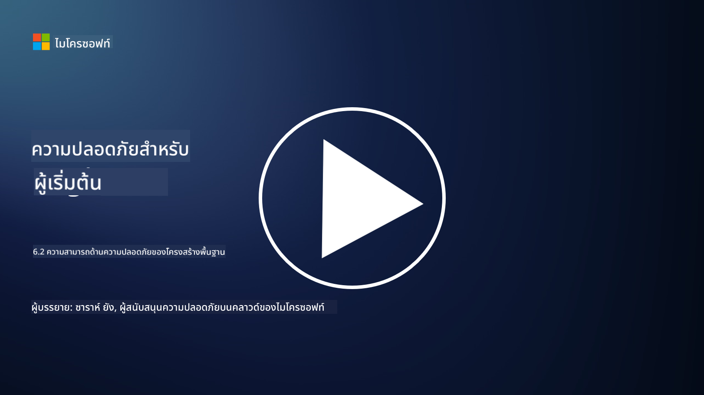

<!--
CO_OP_TRANSLATOR_METADATA:
{
  "original_hash": "7d79ba0e7668b3bdae1fba7aa047f6c0",
  "translation_date": "2025-09-04T00:12:02+00:00",
  "source_file": "6.2 Infrastructure security capabilities.md",
  "language_code": "th"
}
-->
# ความสามารถด้านความปลอดภัยของโครงสร้างพื้นฐาน

ในส่วนนี้ เราจะพูดถึงรายละเอียดเพิ่มเติมเกี่ยวกับเครื่องมือและความสามารถหลักที่ใช้ในด้านความปลอดภัยของโครงสร้างพื้นฐาน

**บทนำ**

ในบทเรียนนี้ เราจะพูดถึง:

- การจัดการช่องโหว่คืออะไร?

- CSPM คืออะไร?

- CNAPP คืออะไร?

## การจัดการช่องโหว่คืออะไร?

การจัดการช่องโหว่เป็นกระบวนการที่เป็นระบบในการระบุ ประเมิน จัดลำดับความสำคัญ ลดผลกระทบ และติดตามช่องโหว่ในระบบคอมพิวเตอร์ ซอฟต์แวร์ เครือข่าย และโครงสร้างพื้นฐาน เป้าหมายหลักของการจัดการช่องโหว่คือการลดความเสี่ยงด้านความปลอดภัยขององค์กรโดยการจัดการช่องโหว่ที่ทราบล่วงหน้าอย่างเชิงรุกก่อนที่ผู้ไม่ประสงค์ดีจะใช้ประโยชน์จากช่องโหว่เหล่านั้น ต่อไปนี้คือภาพรวมของขั้นตอนสำคัญที่เกี่ยวข้อง:

การระบุ: การสแกนและค้นหาช่องโหว่ในทรัพย์สินขององค์กร ซึ่งอาจรวมถึงเซิร์ฟเวอร์ แอปพลิเคชัน อุปกรณ์เครือข่าย และอุปกรณ์ปลายทาง

การประเมิน: การประเมินความรุนแรงและผลกระทบที่อาจเกิดขึ้นจากช่องโหว่แต่ละรายการ โดยพิจารณาจากปัจจัยต่างๆ เช่น คะแนน CVSS (Common Vulnerability Scoring System) และบริบททางธุรกิจ

การจัดลำดับความสำคัญ: การจัดอันดับช่องโหว่ตามระดับความเสี่ยงและผลกระทบที่อาจเกิดขึ้นต่อการดำเนินงานและข้อมูลขององค์กร

การลดผลกระทบ: การพัฒนาและดำเนินกลยุทธ์เพื่อแก้ไขหรือบรรเทาช่องโหว่ ซึ่งอาจรวมถึงการติดตั้งแพตช์ การตั้งค่าความปลอดภัย หรือการใช้มาตรการควบคุมชดเชย

การตรวจสอบ: การยืนยันว่ามาตรการลดผลกระทบมีประสิทธิภาพในการแก้ไขช่องโหว่

การติดตามอย่างต่อเนื่อง: การติดตามช่องโหว่และภัยคุกคามที่อาจเกิดขึ้นอย่างต่อเนื่อง พร้อมการสแกนและการประเมินช่องโหว่เป็นประจำ

การจัดการช่องโหว่เป็นองค์ประกอบสำคัญของการรักษาความปลอดภัยทางไซเบอร์ ช่วยให้องค์กรรักษาท่าทีด้านความปลอดภัยที่แข็งแกร่งและลดโอกาสที่จะเกิดการละเมิดความปลอดภัย ตัวอย่างเครื่องมือการจัดการช่องโหว่ ได้แก่ Defender for Cloud, Nessus และ Qualys

## CSPM คืออะไร?

Cloud Security Posture Management (CSPM) เป็นชุดเครื่องมือ กระบวนการ และแนวปฏิบัติที่ออกแบบมาเพื่อประเมิน ตรวจสอบ และบังคับใช้การตั้งค่าความปลอดภัยและแนวปฏิบัติที่ดีที่สุดในสภาพแวดล้อมคลาวด์ โซลูชัน CSPM ช่วยให้องค์กรสามารถระบุและแก้ไขการตั้งค่าที่ผิดพลาด ช่องว่างด้านความปลอดภัย และการละเมิดข้อกำหนดในโครงสร้างพื้นฐานคลาวด์ เช่น Amazon Web Services (AWS), Microsoft Azure, Google Cloud Platform (GCP) และผู้ให้บริการคลาวด์อื่นๆ

ประเด็นสำคัญของ CSPM ได้แก่:

- การประเมินการตั้งค่า: การสแกนทรัพยากรและบริการคลาวด์เพื่อระบุการตั้งค่าที่ผิดพลาด การตั้งค่าที่ไม่ปลอดภัย และการเบี่ยงเบนจากแนวปฏิบัติด้านความปลอดภัยที่ดีที่สุด

- การบังคับใช้นโยบายความปลอดภัย: การบังคับใช้นโยบายความปลอดภัยและมาตรฐานการปฏิบัติตามข้อกำหนดในสภาพแวดล้อมคลาวด์โดยการแก้ไขการตั้งค่าที่ผิดพลาดโดยอัตโนมัติหรือสร้างการแจ้งเตือน

- การติดตามอย่างต่อเนื่อง: การให้การมองเห็นอย่างต่อเนื่องในท่าทีด้านความปลอดภัยของทรัพย์สินและทรัพยากรคลาวด์ พร้อมการแจ้งเตือนแบบเรียลไทม์สำหรับเหตุการณ์ด้านความปลอดภัย

- การรายงานการปฏิบัติตามข้อกำหนด: การสร้างรายงานและแดชบอร์ดเพื่อแสดงการปฏิบัติตามข้อกำหนดด้านกฎระเบียบและมาตรฐานอุตสาหกรรม

CSPM ช่วยให้องค์กรมั่นใจได้ว่าโครงสร้างพื้นฐานคลาวด์ของพวกเขามีความปลอดภัย สอดคล้องกับข้อกำหนด และสอดคล้องกับแนวปฏิบัติที่ดีที่สุด ลดความเสี่ยงของเหตุการณ์ด้านความปลอดภัยที่เกี่ยวข้องกับคลาวด์ ตัวอย่างเครื่องมือ CSPM ได้แก่ Defender for Cloud และ Snyk

## CNAPP คืออะไร?

CNAPP ย่อมาจาก Cloud-Native Application Protection Platform เป็นแพลตฟอร์มซอฟต์แวร์แบบครบวงจรที่ช่วยลดความซับซ้อนในการตรวจสอบ การตรวจจับ และการดำเนินการกับภัยคุกคามและช่องโหว่ด้านความปลอดภัยในคลาวด์ CNAPP รวมเครื่องมือและความสามารถหลายอย่างไว้ในโซลูชันซอฟต์แวร์เดียวเพื่อลดความซับซ้อนและอำนวยความสะดวกในการดำเนินงานของทีม DevOps และ DevSecOps CNAPP มอบความปลอดภัยแบบครบวงจรสำหรับคลาวด์และแอปพลิเคชันตลอดวงจร CI/CD ตั้งแต่การพัฒนาไปจนถึงการใช้งานจริง มันตอบสนองความต้องการของอุตสาหกรรมสำหรับเครื่องมือการตรวจสอบความปลอดภัยคลาวด์ การจัดการท่าที การป้องกันการละเมิด และการควบคุมที่ทันสมัย โซลูชัน CNAPP ช่วยให้ทีมรักษาความปลอดภัยสามารถวัดและตอบสนองต่อความเสี่ยงในสภาพแวดล้อมคลาวด์ได้ คุณสมบัติบางประการของ CNAPP ได้แก่ การมองเห็นที่เพิ่มขึ้น การวัดความเสี่ยง การพัฒนาซอฟต์แวร์ที่ปลอดภัย และโซลูชันความปลอดภัยคลาวด์แบบรวม CNAPP รวมเครื่องมือรักษาความปลอดภัยคลาวด์หลายตัวที่เคยแยกกันไว้ในอินเทอร์เฟซผู้ใช้เดียว ทำให้องค์กรสามารถปกป้องแอปพลิเคชันคลาวด์ทั้งหมดได้ง่ายขึ้น CNAPP รวมเครื่องมือรักษาความปลอดภัยคลาวด์เนทีฟและแหล่งข้อมูลหลายตัว เช่น การสแกนคอนเทนเนอร์ การจัดการท่าทีด้านความปลอดภัยคลาวด์ การสแกนโครงสร้างพื้นฐานเป็นโค้ด การจัดการสิทธิ์โครงสร้างพื้นฐานคลาวด์ และแพลตฟอร์มการป้องกันเวิร์กโหลดคลาวด์ในระหว่างการทำงาน

## อ่านเพิ่มเติม
- [What is CSPM? | Microsoft Security](https://www.microsoft.com/security/business/security-101/what-is-cspm?WT.mc_id=academic-96948-sayoung)
- [What is Cloud Security Posture Management (CSPM)? | HackerOne](https://www.hackerone.com/knowledge-center/what-cloud-security-posture-management)
- [Function of cloud security posture management - Cloud Adoption Framework | Microsoft Learn](https://learn.microsoft.com/azure/cloud-adoption-framework/organize/cloud-security-posture-management?WT.mc_id=academic-96948-sayoung)
- [What Is a CNAPP? | Microsoft Security](https://www.microsoft.com/security/business/security-101/what-is-cnapp?WT.mc_id=academic-96948-sayoung)
- [Why Everyone Is Talking About CNAPP (forbes.com)](https://www.forbes.com/sites/forbestechcouncil/2021/12/10/why-everyone-is-talking-about-cnapp/?sh=567275ca1549)
- [Improving Your Multi-Cloud Security with a Cloud-Native Application Protection Platform (CNAPP)](https://www.youtube.com/watch?v=5w42kQ_QjZg&t=212s)

---

**ข้อจำกัดความรับผิดชอบ**:  
เอกสารนี้ได้รับการแปลโดยใช้บริการแปลภาษา AI [Co-op Translator](https://github.com/Azure/co-op-translator) แม้ว่าเราจะพยายามให้การแปลมีความถูกต้อง แต่โปรดทราบว่าการแปลอัตโนมัติอาจมีข้อผิดพลาดหรือความไม่แม่นยำ เอกสารต้นฉบับในภาษาต้นทางควรถือเป็นแหล่งข้อมูลที่เชื่อถือได้ สำหรับข้อมูลที่สำคัญ ขอแนะนำให้ใช้บริการแปลภาษามนุษย์ที่เป็นมืออาชีพ เราจะไม่รับผิดชอบต่อความเข้าใจผิดหรือการตีความที่ผิดพลาดซึ่งเกิดจากการใช้การแปลนี้