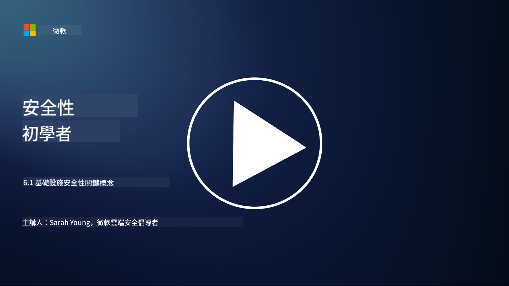

<!--
CO_OP_TRANSLATOR_METADATA:
{
  "original_hash": "882ebf66a648f419bcbf680ed6aefa00",
  "translation_date": "2025-09-03T17:08:29+00:00",
  "source_file": "6.1 Infrastructure security key concepts.md",
  "language_code": "tw"
}
-->
# 基礎架構安全性關鍵概念

「基礎架構」指的是任何 IT 環境的基本構件，包括伺服器、雲端服務和容器——涵蓋了多種不同的技術。在前一部分討論的應用程式都運行於基礎架構之上，因此基礎架構也可能成為攻擊者的目標。

在本課程中，我們將探討：

- 什麼是安全衛生？為什麼它很重要？

- 什麼是安全態勢管理？

- 什麼是修補？為什麼它很重要？

- 什麼是容器？它們的安全性有什麼不同？

## 什麼是安全衛生？為什麼它很重要？

**安全衛生**指的是個人和組織為維持良好的網路安全習慣而遵循的一系列實踐和行為。它包括採取措施保護系統、數據和網路免受威脅和漏洞的侵害。良好的安全衛生非常重要，原因如下：

- **防止攻擊**：遵循最佳實踐可以防止常見的網路攻擊，例如釣魚攻擊、惡意軟體感染和未授權存取。

- **保護數據**：適當的安全衛生可以保護敏感和機密數據免於被竊取或暴露。

- **維持信任**：展現良好安全衛生的組織能夠建立客戶和合作夥伴的信任。

- **合規性**：許多法規和標準要求組織遵循安全衛生實踐。

- **降低風險**：持續的安全衛生能降低安全事件和漏洞的整體風險。

安全衛生包括保持軟體更新、使用強密碼和多重身份驗證、定期備份、員工培訓以及監控可疑活動等實踐。它是強大網路安全態勢的基礎。

## 什麼是安全態勢管理？

安全態勢管理指的是評估、監控和管理組織整體網路安全態勢的實踐。網路安全態勢是指組織保護其資訊技術 (IT) 系統、網路、數據和資產免受網路威脅和攻擊的整體方法和準備情況。它涵蓋了組織用於保護其數位資產並維持資訊的機密性、完整性和可用性的策略、政策、實踐和技術。

安全態勢管理包括評估和維護系統、網路、應用程式和數據的安全性，以確保它們符合安全政策、最佳實踐和合規要求。SPM 的目的是提供組織安全狀態的全面視圖，識別漏洞和弱點，並優先處理修復工作。

## 什麼是修補？為什麼它很重要？

**修補**指的是對軟體、操作系統和應用程式進行更新，也稱為補丁或修復的過程。這些更新通常用於解決安全漏洞、錯誤以及其他可能被攻擊者利用的問題。硬體設備也需要修補，例如其韌體或內建操作系統。硬體修補通常比軟體修補更具挑戰性。

修補的重要性如下：

- **安全性**：補丁修復已知漏洞，防止攻擊者利用這些漏洞來入侵系統或竊取數據。

- **穩定性**：補丁通常包含穩定性和性能改進，降低系統崩潰或故障的風險。

- **合規性**：許多法規和合規標準要求組織及時應用安全補丁。

- **維持信任**：定期修補能向客戶和利益相關者展示對安全的承諾，從而維持信任。

- **降低風險**：修補能減少攻擊面，降低網路攻擊成功的可能性。

未能及時應用補丁可能使系統暴露於已知漏洞之下，增加安全漏洞和數據丟失的風險。

## 什麼是容器？它們的安全性有什麼不同？

容器是一種輕量級、獨立且可執行的軟體包，包含運行軟體所需的一切，包括代碼、運行時、庫和系統工具。容器提供了一個一致且隔離的應用程式運行環境，使軟體能夠更輕鬆地在不同環境和平台上開發、打包和部署。常見的容器化技術包括 Docker 和 Kubernetes。

容器安全指的是保護容器及其承載的應用程式免受各種安全威脅和漏洞的實踐和技術。容器安全至關重要，因為儘管容器在可移植性和可擴展性方面具有許多優勢，但它們也帶來了潛在的安全挑戰：

1. **映像安全**：容器映像可能包含漏洞，如果這些映像未定期更新和修補，攻擊者可能會利用它們。容器安全包括掃描映像以檢測已知漏洞，並確保僅使用可信映像。

2. **運行時安全**：運行中的容器必須彼此隔離並與主機系統隔離，以防止未授權存取和潛在攻擊。運行時安全機制包括命名空間和 cgroups 等容器隔離技術，以及監控和審核容器行為的工具。

3. **網路安全**：容器通過網路彼此通信並與外部系統交互。適當的網路分段和防火牆規則對於控制容器之間的流量並防止未授權存取至關重要。

4. **存取控制**：確保只有授權的使用者和進程能夠存取和修改容器至關重要。通常使用基於角色的存取控制 (RBAC) 和身份管理工具來進行存取控制。

5. **日誌和監控**：容器安全包括收集和分析日誌以及監控數據，以便實時檢測和應對安全事件和異常。

6. **編排安全**：使用容器編排平台（如 Kubernetes）時，保護編排層同樣重要。這包括保護 Kubernetes API 伺服器、確保適當的 RBAC 策略以及審核集群活動。

7. **機密管理**：在容器中處理敏感信息（如 API 密鑰和密碼）需要安全的存儲和管理解決方案，以防止信息暴露。

容器安全解決方案通常結合安全最佳實踐、漏洞掃描工具、運行時保護機制、網路安全配置以及容器編排安全功能。持續監控和自動化是容器安全的核心組成部分，能快速檢測和應對威脅，隨著容器化應用程式的演進和擴展保持安全。

## 延伸閱讀

- [安全衛生的重要性 | Security Magazine](https://www.securitymagazine.com/articles/99510-the-importance-of-security-hygiene)
- [什麼是 CSPM？| Microsoft Security](https://www.microsoft.com/security/business/security-101/what-is-cspm?WT.mc_id=academic-96948-sayoung)
- [什麼是雲安全態勢管理 (CSPM)？| HackerOne](https://www.hackerone.com/knowledge-center/what-cloud-security-posture-management)
- [雲安全態勢管理的功能 - Cloud Adoption Framework | Microsoft Learn](https://learn.microsoft.com/azure/cloud-adoption-framework/organize/cloud-security-posture-management?WT.mc_id=academic-96948-sayoung)
- [什麼是 CNAPP？| Microsoft Security](https://www.microsoft.com/security/business/security-101/what-is-cnapp)
- [為什麼大家都在談論 CNAPP (forbes.com)](https://www.forbes.com/sites/forbestechcouncil/2021/12/10/why-everyone-is-talking-about-cnapp/?sh=567275ca1549)
- [為什麼修補對網路安全至關重要？- CyberSmart](https://cybersmart.co.uk/blog/why-is-patching-important-to-cybersecurity/)
- [什麼是容器安全？完整指南 [2023] (aquasec.com)](https://www.aquasec.com/cloud-native-academy/container-security/container-security/)

---

**免責聲明**：  
本文件已使用 AI 翻譯服務 [Co-op Translator](https://github.com/Azure/co-op-translator) 進行翻譯。儘管我們努力確保翻譯的準確性，但請注意，自動翻譯可能包含錯誤或不精確之處。原始文件的母語版本應被視為權威來源。對於關鍵資訊，建議尋求專業人工翻譯。我們對因使用此翻譯而引起的任何誤解或錯誤解釋不承擔責任。