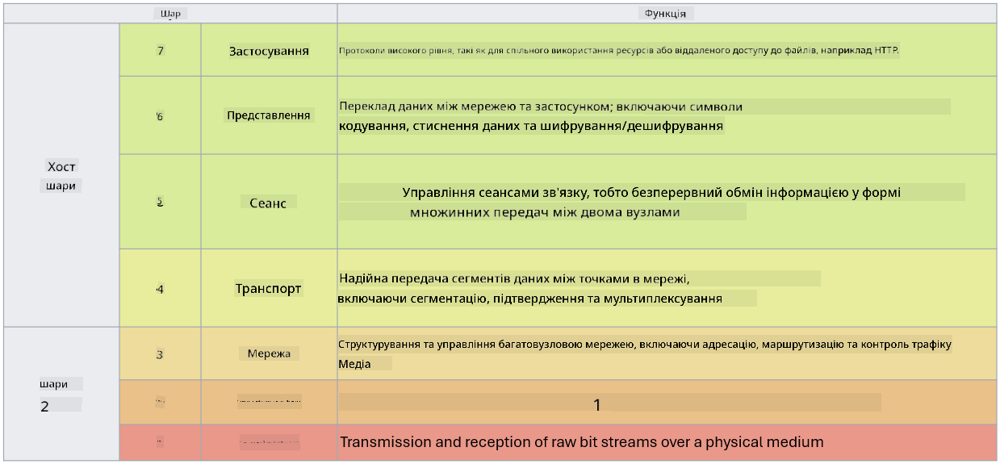

<!--
CO_OP_TRANSLATOR_METADATA:
{
  "original_hash": "252724eceeb183fb9018f88c5e1a3f0c",
  "translation_date": "2025-09-03T22:07:32+00:00",
  "source_file": "3.1 Networking key concepts.md",
  "language_code": "uk"
}
-->
# Основні концепції мереж

Якщо ви працювали в сфері IT, то, ймовірно, вже стикалися з концепціями мереж. Хоча в сучасних середовищах ми використовуємо ідентифікацію як основний засіб контролю периметра, це не означає, що мережеві засоби контролю стали зайвими. Незважаючи на те, що ця тема є дуже обширною, у цьому уроці ми розглянемо ключові концепції мереж.

У цьому уроці ми розглянемо:

- Що таке IP-адресація?

- Що таке модель OSI?

- Що таке TCP/UDP?

- Що таке номери портів?

- Що таке шифрування даних у стані спокою та під час передачі?

## Що таке IP-адресація?

IP-адресація, або адресація Інтернет-протоколу, — це числовий ідентифікатор, який присвоюється кожному пристрою, підключеному до комп'ютерної мережі, що використовує Інтернет-протокол для зв'язку. Вона служить унікальним ідентифікатором для пристроїв у мережі, дозволяючи їм надсилати та отримувати дані через інтернет або інші взаємопов'язані мережі. Існує дві основні версії IP-адресації: IPv4 (версія Інтернет-протоколу 4) та IPv6 (версія Інтернет-протоколу 6). IP-адреса зазвичай представлена у форматі IPv4 (наприклад, 192.168.1.1) або у форматі IPv6 (наприклад, 2001:0db8:85a3:0000:0000:8a2e:0370:7334).

## Що таке модель OSI?

Модель OSI (Open Systems Interconnection) — це концептуальна структура, яка стандартизує функції системи зв'язку на сім окремих рівнів. Кожен рівень виконує певні завдання та взаємодіє із сусідніми рівнями, забезпечуючи ефективну та надійну передачу даних між пристроями в мережі. Рівні, починаючи з нижнього до верхнього, виглядають так:

1. Фізичний рівень

2. Канальний рівень

3. Мережевий рівень

4. Транспортний рівень

5. Сеансовий рівень

6. Представницький рівень

7. Прикладний рівень

Модель OSI забезпечує загальне розуміння того, як мережеві протоколи та технології взаємодіють, незалежно від конкретного апаратного чи програмного забезпечення.

_ref: https://en.wikipedia.org/wiki/OSI_model_

## Що таке TCP/UDP?

TCP (Transmission Control Protocol) і UDP (User Datagram Protocol) — це два основні протоколи транспортного рівня, які використовуються в комп'ютерних мережах для забезпечення зв'язку між пристроями через інтернет або локальну мережу. Вони відповідають за розбиття даних на пакети для передачі та їх збирання у вихідні дані на приймальному боці. Однак вони мають різні характеристики та сфери застосування.

**TCP (Transmission Control Protocol)**:

TCP — це протокол, орієнтований на з'єднання, який забезпечує надійну та впорядковану доставку даних між пристроями. Він встановлює з'єднання між відправником і отримувачем перед початком обміну даними. TCP гарантує, що пакети даних прибудуть у правильному порядку, і може повторно передавати втрачені пакети, щоб забезпечити цілісність і повноту даних. Це робить TCP придатним для застосунків, які потребують надійної доставки даних, таких як веб-перегляд, електронна пошта, передача файлів (FTP) та зв'язок із базами даних.

**UDP (User Datagram Protocol)**:

UDP — це протокол без встановлення з'єднання, який забезпечує швидшу передачу даних, але не гарантує такої ж надійності, як TCP. Він не встановлює формального з'єднання перед передачею даних і не включає механізми для підтвердження або повторної передачі втрачених пакетів. UDP підходить для застосунків, де швидкість і ефективність важливіші за гарантовану доставку, таких як реальний час зв'язку, потокове медіа, онлайн-ігри та DNS-запити.

У підсумку, TCP надає пріоритет надійності та впорядкованій доставці, що робить його придатним для застосунків, які потребують точності даних, тоді як UDP акцентує увагу на швидкості та ефективності, що робить його доречним для застосунків, де незначна втрата даних або зміна порядку прийнятна в обмін на зменшення затримки. Вибір між TCP і UDP залежить від конкретних вимог застосунку або сервісу.

## Що таке номери портів?

У мережах номер порту — це числовий ідентифікатор, який використовується для розрізнення різних сервісів або застосунків, що працюють на одному пристрої в мережі. Порти допомагають направляти вхідні дані до відповідного застосунку. Номери портів є 16-бітними беззнаковими цілими числами, що означає, що вони варіюються від 0 до 65535. Вони поділяються на три діапазони:

- Відомі порти (0-1023): Зарезервовані для стандартних сервісів, таких як HTTP (порт 80) і FTP (порт 21).

- Зареєстровані порти (1024-49151): Використовуються для застосунків і сервісів, які не входять до відомого діапазону, але офіційно зареєстровані.

- Динамічні/приватні порти (49152-65535): Доступні для тимчасового або приватного використання застосунками.

## Що таке шифрування даних у стані спокою та під час передачі?

Шифрування — це процес перетворення даних у захищений формат для захисту від несанкціонованого доступу або втручання. Шифрування може застосовуватися до даних як "у стані спокою" (коли вони зберігаються на пристрої або сервері), так і "під час передачі" (коли вони передаються між пристроями або через мережі).

Шифрування у стані спокою: Це передбачає шифрування даних, які зберігаються на пристроях, серверах або системах зберігання. Навіть якщо зловмисник отримає фізичний доступ до носія даних, він не зможе отримати доступ до даних без ключів шифрування. Це важливо для захисту конфіденційних даних у разі крадіжки пристрою, витоку даних або несанкціонованого доступу.

Шифрування під час передачі: Це передбачає шифрування даних під час їх передачі між пристроями або через мережі. Це запобігає прослуховуванню та несанкціонованому перехопленню даних під час передачі. Загальні протоколи для шифрування під час передачі включають HTTPS для веб-комунікації та TLS/SSL для захисту різних типів мережевого трафіку.

## Додаткове читання
- [How Do IP Addresses Work? (howtogeek.com)](https://www.howtogeek.com/341307/how-do-ip-addresses-work/)
- [Understanding IP Address: An Introductory Guide (geekflare.com)](https://geekflare.com/understanding-ip-address/)
- [What is the OSI model? The 7 layers of OSI explained (techtarget.com)](https://www.techtarget.com/searchnetworking/definition/OSI)
- [The OSI Model – The 7 Layers of Networking Explained in Plain English (freecodecamp.org)](https://www.freecodecamp.org/news/osi-model-networking-layers-explained-in-plain-english/)
- [TCP/IP protocols - IBM Documentation](https://www.ibm.com/docs/en/aix/7.3?topic=protocol-tcpip-protocols)
- [Common Ports Cheat Sheet: The Ultimate Ports & Protocols List (stationx.net)](https://www.stationx.net/common-ports-cheat-sheet/)
- [Azure Data Encryption-at-Rest - Azure Security | Microsoft Learn](https://learn.microsoft.com/azure/security/fundamentals/encryption-atrest?WT.mc_id=academic-96948-sayoung)

---

**Відмова від відповідальності**:  
Цей документ був перекладений за допомогою сервісу автоматичного перекладу [Co-op Translator](https://github.com/Azure/co-op-translator). Хоча ми прагнемо до точності, будь ласка, майте на увазі, що автоматичні переклади можуть містити помилки або неточності. Оригінальний документ на його рідній мові слід вважати авторитетним джерелом. Для критичної інформації рекомендується професійний людський переклад. Ми не несемо відповідальності за будь-які непорозуміння або неправильні тлумачення, що виникають внаслідок використання цього перекладу.