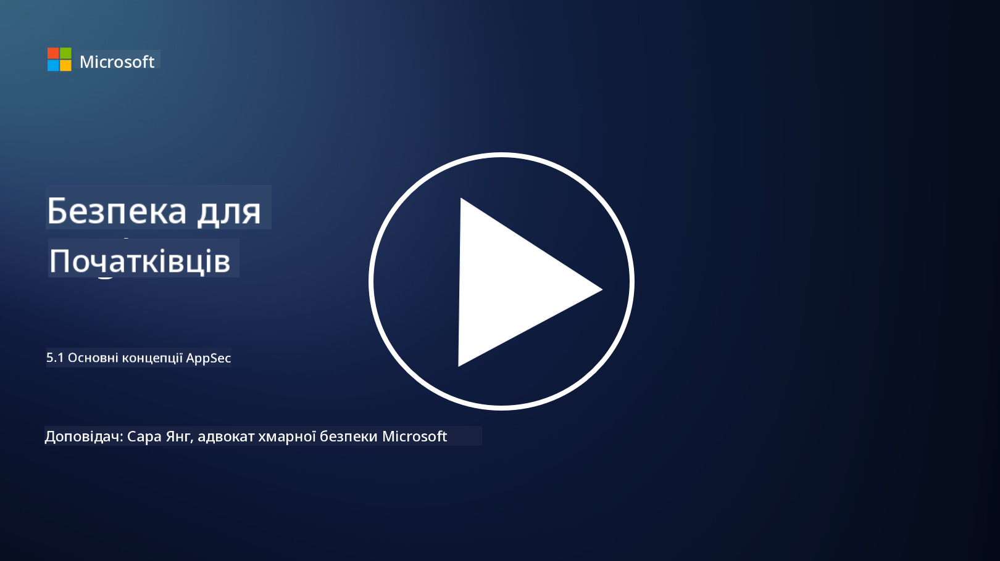

<!--
CO_OP_TRANSLATOR_METADATA:
{
  "original_hash": "e4b56bb23078d3ffb7ad407d280b0c36",
  "translation_date": "2025-09-03T21:11:10+00:00",
  "source_file": "5.1 AppSec key concepts.md",
  "language_code": "uk"
}
-->
# Основні концепції безпеки додатків

Безпека додатків є окремою спеціалізацією в сфері кібербезпеки. У цій частині курсу ми детальніше розглянемо безпеку додатків.

## Вступ

У цьому уроці ми розглянемо:

- Що таке безпека додатків?

- Які ключові концепції/принципи безпеки додатків?

## Що таке безпека додатків?

Безпека додатків, часто скорочено "AppSec", означає практику захисту програмного забезпечення від загроз, вразливостей та атак. Вона охоплює процеси, техніки та інструменти, які використовуються для виявлення, пом'якшення та запобігання ризикам безпеки протягом усього життєвого циклу розробки, розгортання та підтримки додатків.

Безпека додатків є критично важливою, оскільки додатки часто стають мішенню для кіберзлочинців. Зловмисники використовують вразливості та слабкі місця в програмному забезпеченні, щоб отримати несанкціонований доступ, викрасти дані, порушити роботу сервісів або здійснити інші шкідливі дії. Ефективна безпека додатків допомагає забезпечити конфіденційність, цілісність і доступність додатків та пов'язаних із ними даних.

## Які ключові концепції/принципи безпеки додатків?

Ключові концепції та принципи, які лежать в основі безпеки додатків, включають:

1. **Безпека за дизайном**:

- Безпека повинна бути інтегрована в дизайн і архітектуру додатка з самого початку, а не додаватися пізніше.

2. **Валідація введення**:

- Усі дані, введені користувачем, повинні перевірятися, щоб гарантувати їх відповідність очікуваним форматам і відсутність шкідливого коду чи даних.

3. **Кодування вихідних даних**:

- Дані, які надсилаються клієнту, повинні бути належним чином закодовані, щоб запобігти вразливостям, таким як міжсайтовий скриптинг (XSS).

4. **Аутентифікація та авторизація**:

- Аутентифікуйте користувачів і надавайте їм доступ до ресурсів відповідно до їхніх ролей і дозволів.

5. **Захист даних**:

- Конфіденційні дані повинні бути зашифровані під час зберігання, передачі та обробки, щоб запобігти несанкціонованому доступу.

6. **Управління сесіями**:

- Безпечне управління сесіями гарантує захист користувацьких сесій від викрадення та несанкціонованого доступу.

7. **Безпечні залежності**:

- Усі програмні залежності повинні бути оновлені з урахуванням виправлень безпеки, щоб запобігти вразливостям.

8. **Обробка помилок і логування**:

- Реалізуйте безпечну обробку помилок, щоб уникнути розкриття конфіденційної інформації, і забезпечте безпечні практики логування.

9. **Тестування безпеки**:

- Регулярно тестуйте додатки на вразливості за допомогою методів, таких як тестування на проникнення, ревізія коду та автоматизовані інструменти сканування.

10. **Безпечний життєвий цикл розробки програмного забезпечення (SDLC)**:

- Інтегруйте практики безпеки на кожному етапі життєвого циклу розробки програмного забезпечення — від вимог до розгортання та підтримки.

## Додаткові матеріали

- [SheHacksPurple: Що таке безпека додатків? - YouTube](https://www.youtube.com/watch?v=eNmccQNzSSY)
- [Що таке безпека додатків? - Cisco](https://www.cisco.com/c/en/us/solutions/security/application-first-security/what-is-application-security.html#~how-does-it-work)
- [Що таке безпека додатків? Процес і інструменти для захисту програмного забезпечення | CSO Online](https://www.csoonline.com/article/566471/what-is-application-security-a-process-and-tools-for-securing-software.html)
- [OWASP Cheat Sheet Series | OWASP Foundation](https://owasp.org/www-project-cheat-sheets/)

---

**Відмова від відповідальності**:  
Цей документ був перекладений за допомогою сервісу автоматичного перекладу [Co-op Translator](https://github.com/Azure/co-op-translator). Хоча ми прагнемо до точності, будь ласка, майте на увазі, що автоматичні переклади можуть містити помилки або неточності. Оригінальний документ на його рідній мові слід вважати авторитетним джерелом. Для критичної інформації рекомендується професійний людський переклад. Ми не несемо відповідальності за будь-які непорозуміння або неправильні тлумачення, що виникають внаслідок використання цього перекладу.