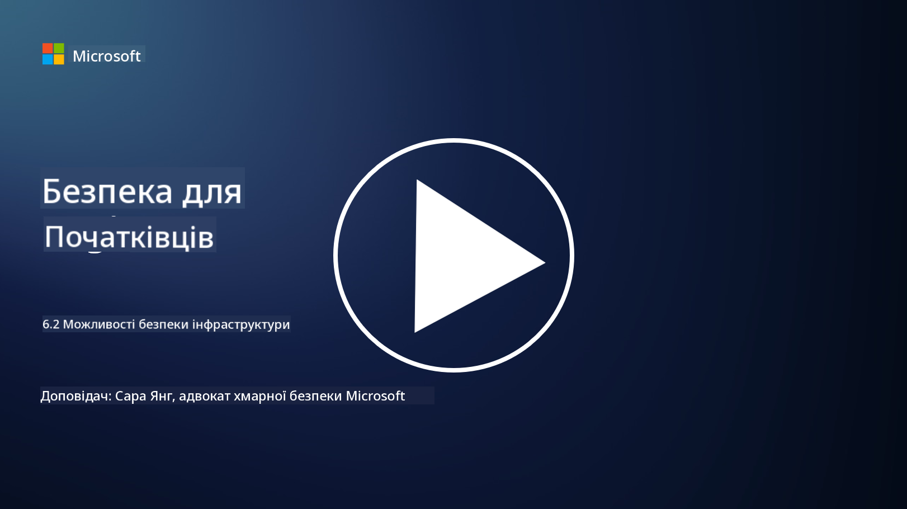

<!--
CO_OP_TRANSLATOR_METADATA:
{
  "original_hash": "7d79ba0e7668b3bdae1fba7aa047f6c0",
  "translation_date": "2025-09-03T20:56:59+00:00",
  "source_file": "6.2 Infrastructure security capabilities.md",
  "language_code": "uk"
}
-->
# Можливості безпеки інфраструктури

У цьому розділі ми розглянемо детальніше основні інструменти та можливості, які використовуються для забезпечення безпеки інфраструктури.

**Вступ**

У цьому уроці ми розглянемо:

- Що таке управління вразливостями?

- Що таке CSPM?

- Що таке CNAPP?

## Що таке управління вразливостями?

Управління вразливостями — це систематичний процес ідентифікації, оцінки, пріоритизації, усунення та моніторингу вразливостей у комп'ютерних системах, програмному забезпеченні, мережах та інфраструктурі. Основна мета управління вразливостями — зменшити ризики для організації, проактивно усуваючи відомі вразливості до того, як вони можуть бути використані зловмисниками. Ось огляд основних етапів процесу:

Ідентифікація: Сканування та виявлення вразливостей у активах організації, таких як сервери, додатки, мережеві пристрої та кінцеві точки.

Оцінка: Аналіз серйозності та потенційного впливу кожної вразливості на основі таких факторів, як оцінка за системою CVSS (Common Vulnerability Scoring System) та бізнес-контекст.

Пріоритизація: Ранжування вразливостей за рівнем ризику та потенційним впливом на операції та дані організації.

Усунення: Розробка та впровадження стратегій для усунення або пом'якшення вразливостей, таких як встановлення оновлень, налаштування параметрів безпеки або впровадження компенсуючих заходів.

Перевірка: Підтвердження ефективності заходів усунення вразливостей.

Безперервний моніторинг: Постійне відстеження вразливостей та потенційних загроз за допомогою регулярних сканувань та оцінок.

Управління вразливостями є важливим компонентом кібербезпеки, допомагаючи організаціям підтримувати сильну безпекову позицію та зменшувати ймовірність порушень безпеки. Приклади інструментів для управління вразливостями: Defender for Cloud, Nessus і Qualys.

## Що таке CSPM?

Cloud Security Posture Management (CSPM) — це набір інструментів, процесів та практик, призначених для оцінки, моніторингу та забезпечення налаштувань безпеки та найкращих практик у хмарних середовищах. Рішення CSPM допомагають організаціям виявляти та усувати неправильні налаштування, прогалини в безпеці та порушення вимог відповідності у хмарній інфраструктурі, таких як Amazon Web Services (AWS), Microsoft Azure, Google Cloud Platform (GCP) та інших хмарних провайдерів.

Основні аспекти CSPM включають:

- Оцінка конфігурації: Сканування хмарних ресурсів і сервісів для виявлення неправильних налаштувань, небезпечних параметрів та відхилень від найкращих практик безпеки.

- Забезпечення політик безпеки: Впровадження політик безпеки та стандартів відповідності у хмарних середовищах шляхом автоматичного усунення неправильних налаштувань або створення сповіщень.

- Безперервний моніторинг: Забезпечення постійної видимості стану безпеки хмарних активів і ресурсів із реальними сповіщеннями про інциденти безпеки.

- Звітування про відповідність: Генерація звітів і панелей для демонстрації відповідності регуляторним вимогам та галузевим стандартам.

CSPM допомагає організаціям забезпечити безпеку, відповідність та дотримання найкращих практик у хмарній інфраструктурі, зменшуючи ризик інцидентів, пов'язаних із хмарною безпекою. Приклади інструментів CSPM: Defender for Cloud і Snyk.

## Що таке CNAPP?

CNAPP означає Cloud-Native Application Protection Platform. Це комплексна хмарно-орієнтована платформа, яка спрощує моніторинг, виявлення та реагування на потенційні загрози та вразливості хмарної безпеки. Вона об'єднує кілька інструментів і можливостей в одному програмному рішенні, щоб мінімізувати складність і полегшити роботу команд DevOps і DevSecOps. CNAPP забезпечує комплексну безпеку хмарних додатків протягом усього життєвого циклу CI/CD, від розробки до виробництва. Вона відповідає потребам галузі у сучасних інструментах моніторингу хмарної безпеки, управління станом безпеки, запобігання порушенням та контролю. Рішення CNAPP надають командам безпеки можливість оцінювати та реагувати на ризики у хмарному середовищі. Деякі функції CNAPP включають покращену видимість, оцінку ризиків, безпечну розробку програмного забезпечення та об'єднане рішення для хмарної безпеки. CNAPP інтегрує кілька рішень хмарної безпеки, які традиційно були розділені, в одному інтерфейсі, що спрощує захист усієї хмарної інфраструктури організації. CNAPP об'єднує кілька інструментів хмарної безпеки та джерел даних, включаючи сканування контейнерів, управління станом хмарної безпеки, сканування інфраструктури як коду, управління правами хмарної інфраструктури та платформи захисту робочих навантажень у хмарі.

## Додаткові матеріали
- [Що таке CSPM? | Microsoft Security](https://www.microsoft.com/security/business/security-101/what-is-cspm?WT.mc_id=academic-96948-sayoung)
- [Що таке Cloud Security Posture Management (CSPM)? | HackerOne](https://www.hackerone.com/knowledge-center/what-cloud-security-posture-management)
- [Функція управління станом хмарної безпеки - Cloud Adoption Framework | Microsoft Learn](https://learn.microsoft.com/azure/cloud-adoption-framework/organize/cloud-security-posture-management?WT.mc_id=academic-96948-sayoung)
- [Що таке CNAPP? | Microsoft Security](https://www.microsoft.com/security/business/security-101/what-is-cnapp?WT.mc_id=academic-96948-sayoung)
- [Чому всі говорять про CNAPP (forbes.com)](https://www.forbes.com/sites/forbestechcouncil/2021/12/10/why-everyone-is-talking-about-cnapp/?sh=567275ca1549)
- [Покращення багатохмарної безпеки за допомогою Cloud-Native Application Protection Platform (CNAPP)](https://www.youtube.com/watch?v=5w42kQ_QjZg&t=212s)

---

**Відмова від відповідальності**:  
Цей документ був перекладений за допомогою сервісу автоматичного перекладу [Co-op Translator](https://github.com/Azure/co-op-translator). Хоча ми прагнемо до точності, будь ласка, майте на увазі, що автоматичні переклади можуть містити помилки або неточності. Оригінальний документ на його рідній мові слід вважати авторитетним джерелом. Для критичної інформації рекомендується професійний людський переклад. Ми не несемо відповідальності за будь-які непорозуміння або неправильні тлумачення, що виникають внаслідок використання цього перекладу.