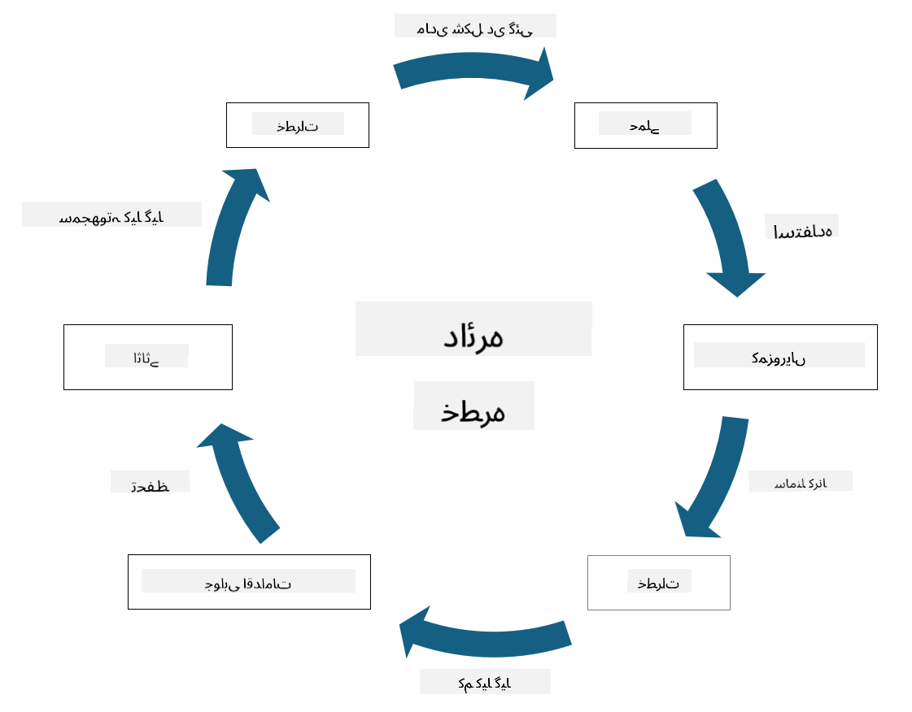

<!--
CO_OP_TRANSLATOR_METADATA:
{
  "original_hash": "fcca304f072cabf206388199e8e2e578",
  "translation_date": "2025-09-03T21:58:53+00:00",
  "source_file": "1.3 Understanding risk management.md",
  "language_code": "ur"
}
-->
# خطرات کے انتظام کو سمجھنا

## تعارف

اس سبق میں ہم درج ذیل موضوعات کا احاطہ کریں گے:

- عام طور پر استعمال ہونے والے سیکیورٹی اصطلاحات کی تعریفیں

- سیکیورٹی کنٹرولز کی اقسام

- سیکیورٹی خطرات کا جائزہ لینا

## عام طور پر استعمال ہونے والے سیکیورٹی اصطلاحات کی تعریفیں

یہ اصطلاحات سائبر سیکیورٹی اور خطرات کے انتظام کے میدان میں بنیادی تصورات ہیں۔ آئیے ہر اصطلاح کو تفصیل سے سمجھتے ہیں اور ان کے آپس کے تعلقات کو جانتے ہیں:

1. **تھریٹ ایجنٹ**:

تھریٹ ایجنٹ ایک فرد، گروپ، تنظیم، یا خودکار نظام ہوتا ہے جو کسی نظام یا نیٹ ورک میں موجود کمزوریوں کا فائدہ اٹھا کر نقصان یا خرابی پیدا کر سکتا ہے۔ تھریٹ ایجنٹس میں ہیکرز، میلویئر تخلیق کرنے والے، ناراض ملازمین، یا کوئی بھی ایسی ہستی شامل ہو سکتی ہے جو معلومات اور ٹیکنالوجی کے نظام کے لیے خطرہ بن سکتی ہے۔

2. **تھریٹ**:

تھریٹ ایک ممکنہ واقعہ یا عمل ہے جو کسی نظام کی کمزوریوں کا فائدہ اٹھا کر کسی اثاثے کو نقصان پہنچا سکتا ہے۔ تھریٹس میں ہیکنگ، ڈیٹا چوری، ڈینائل آف سروس حملے، اور دیگر شامل ہو سکتے ہیں۔ تھریٹس وہ "کیا" ہیں جو کسی تنظیم کے اثاثوں کو نقصان پہنچا سکتے ہیں۔

3. **وَنرَیبِلٹی**:

وَنرَیبِلٹی کسی نظام کے ڈیزائن، عمل درآمد، یا کنفیگریشن میں موجود کمزوری یا خامی ہے جسے تھریٹ ایجنٹ نظام کی سیکیورٹی کو نقصان پہنچانے کے لیے استعمال کر سکتا ہے۔ ونرَیبِلٹیز سافٹ ویئر، ہارڈ ویئر، عمل، یا انسانی رویے میں موجود ہو سکتی ہیں۔ ونرَیبِلٹیز کی شناخت اور ان کا حل خطرات کو کم کرنے کے لیے ضروری ہے۔

4. **رسک**:

رسک نقصان، خرابی، یا نقصان کا وہ امکان ہے جو تھریٹ اور ونرَیبِلٹی کے درمیان تعامل سے پیدا ہوتا ہے۔ یہ وہ امکان ہے کہ تھریٹ ایجنٹ ونرَیبِلٹی کا فائدہ اٹھا کر منفی اثر ڈالے گا۔ رسک کو اکثر اس کے ممکنہ اثرات اور وقوع پذیر ہونے کے امکان کے لحاظ سے جانچا جاتا ہے۔

5. **اثاثہ**:

اثاثہ وہ چیز ہے جس کی حفاظت کرنا تنظیم کی خواہش ہوتی ہے۔ اثاثے جسمانی اشیاء (جیسے کمپیوٹرز اور سرورز)، ڈیٹا (گاہک کی معلومات، مالی ریکارڈز)، دانشورانہ ملکیت (تجارتی راز، پیٹنٹس)، اور انسانی وسائل (ملازمین کی مہارت اور علم) شامل ہو سکتے ہیں۔ اثاثوں کی حفاظت سائبر سیکیورٹی کا ایک اہم مقصد ہے۔

6. **ایکسپوژر**:

ایکسپوژر وہ حالت ہے جب کوئی نظام ممکنہ تھریٹس کے لیے ونرَیبِل ہو۔ یہ اس وقت ہوتا ہے جب کوئی ونرَیبِلٹی موجود ہو جسے تھریٹ ایجنٹ استعمال کر سکتا ہو۔ ایکسپوژر اس خطرے کو ظاہر کرتا ہے جو کسی نظام یا نیٹ ورک میں ونرَیبِلٹیز کی موجودگی سے وابستہ ہوتا ہے۔

7. **کنٹرول**:

کنٹرول وہ اقدام ہے جو ونرَیبِلٹیز اور تھریٹس سے وابستہ خطرے کو کم کرنے کے لیے نافذ کیا جاتا ہے۔ کنٹرولز تکنیکی، طریقہ کار، یا انتظامی نوعیت کے ہو سکتے ہیں۔ یہ تھریٹس اور ونرَیبِلٹیز کو روکنے، شناخت کرنے، یا ان کے اثرات کو کم کرنے کے لیے بنائے گئے ہیں۔ مثالوں میں فائر والز، ایکسیس کنٹرولز، انکرپشن، سیکیورٹی پالیسیاں، اور ملازمین کی تربیت شامل ہیں۔

ان اصطلاحات کے درمیان تعلق کو خلاصہ کرتے ہوئے: تھریٹ ایجنٹس ونرَیبِلٹیز کا فائدہ اٹھا کر تھریٹس کو انجام دیتے ہیں، جو رسک پیدا کرتے ہیں اور قیمتی اثاثوں کو نقصان پہنچا سکتے ہیں۔ ایکسپوژر اس وقت ہوتا ہے جب ونرَیبِلٹیز موجود ہوں، اور کنٹرولز خطرے کو کم کرنے کے لیے نافذ کیے جاتے ہیں تاکہ تھریٹس کے اثرات کو اثاثوں پر کم کیا جا سکے۔ یہ فریم ورک سائبر سیکیورٹی رسک مینجمنٹ کی بنیاد بناتا ہے، جو تنظیموں کو ان کے معلوماتی نظاموں اور اثاثوں کے ممکنہ خطرات کی شناخت، جائزہ لینے، اور ان سے نمٹنے میں رہنمائی فراہم کرتا ہے۔

## سیکیورٹی کنٹرولز کی اقسام

سیکیورٹی کنٹرولز وہ اقدامات یا حفاظتی تدابیر ہیں جو معلوماتی نظاموں اور اثاثوں کو مختلف تھریٹس اور ونرَیبِلٹیز سے بچانے کے لیے نافذ کیے جاتے ہیں۔ انہیں ان کے مقصد اور توجہ کے لحاظ سے کئی اقسام میں تقسیم کیا جا سکتا ہے۔ یہاں سیکیورٹی کنٹرولز کی عام اقسام ہیں:

1. **انتظامی کنٹرولز**:

یہ کنٹرولز تنظیم کی سیکیورٹی پریکٹسز اور صارف کے رویے کو منظم کرنے والی پالیسیاں، طریقہ کار، اور رہنما اصولوں سے متعلق ہیں۔

- سیکیورٹی پالیسیاں اور طریقہ کار: دستاویزی رہنما اصول جو تنظیم میں سیکیورٹی کو برقرار رکھنے کا طریقہ بیان کرتے ہیں۔

- سیکیورٹی آگاہی اور تربیت: ملازمین کو سیکیورٹی کے بہترین طریقوں اور ممکنہ تھریٹس کے بارے میں تعلیم دینے کے پروگرام۔

- واقعہ کے ردعمل اور انتظام: سیکیورٹی واقعات سے نمٹنے اور ان کے اثرات کو کم کرنے کے منصوبے۔

2. **تکنیکی کنٹرولز**:

تکنیکی کنٹرولز سیکیورٹی اقدامات کو نافذ کرنے اور نظاموں اور ڈیٹا کی حفاظت کے لیے ٹیکنالوجی کے استعمال سے متعلق ہیں۔ تکنیکی کنٹرولز کی مثالیں:

- ایکسیس کنٹرولز: وہ اقدامات جو صارفین کی رسائی کو ان کے کرداروں اور اجازتوں کے مطابق محدود کرتے ہیں۔

- انکرپشن: ڈیٹا کو محفوظ فارمیٹ میں تبدیل کرنا تاکہ غیر مجاز رسائی کو روکا جا سکے۔

- فائر والز: نیٹ ورک سیکیورٹی ڈیوائسز جو آنے اور جانے والے ٹریفک کو فلٹر اور کنٹرول کرتی ہیں۔

- انٹروژن ڈیٹیکشن اور پریوینشن سسٹمز (IDPS): وہ ٹولز جو نیٹ ورک ٹریفک کو مشکوک سرگرمی کے لیے مانیٹر کرتے ہیں۔

- اینٹی وائرس اور اینٹی میلویئر سافٹ ویئر: وہ پروگرام جو نقصان دہ سافٹ ویئر کو شناخت اور ختم کرتے ہیں۔

- تصدیق کے طریقے: صارفین کی شناخت کی تصدیق کے طریقے، جیسے پاس ورڈز، بایومیٹرکس، اور ملٹی فیکٹر تصدیق۔

- پیچ مینجمنٹ: سافٹ ویئر کو باقاعدگی سے اپ ڈیٹ کرنا تاکہ معلوم ونرَیبِلٹیز کو حل کیا جا سکے۔

3. **فزیکل کنٹرولز**:

فزیکل کنٹرولز جسمانی اثاثوں اور سہولیات کی حفاظت کے اقدامات ہیں۔

- سیکیورٹی گارڈز اور ایکسیس کنٹرول پرسنل: وہ افراد جو جسمانی جگہوں تک رسائی کی نگرانی اور کنٹرول کرتے ہیں۔

- نگرانی کے کیمرے: ویڈیو مانیٹرنگ سسٹمز جو سرگرمیوں کی نگرانی اور ریکارڈ کرتے ہیں۔

- تالے اور جسمانی رکاوٹیں: حساس علاقوں تک رسائی کو محدود کرنے کے جسمانی اقدامات۔

- ماحولیاتی کنٹرولز: وہ اقدامات جو درجہ حرارت، نمی، اور دیگر ماحولیاتی عوامل کو منظم کرتے ہیں جو آلات اور ڈیٹا سینٹرز کو متاثر کرتے ہیں۔

4. **آپریشنل کنٹرولز**:

یہ کنٹرولز روزمرہ کے آپریشنز اور سرگرمیوں سے متعلق ہیں جو نظاموں کی جاری سیکیورٹی کو یقینی بناتے ہیں۔

- تبدیلی کا انتظام: نظاموں اور کنفیگریشنز میں تبدیلیوں کو ٹریک کرنے اور منظور کرنے کے عمل۔

- بیک اپ اور ڈیزاسٹر ریکوری: ڈیٹا بیک اپ اور نظام کی ناکامی یا آفات کی صورت میں بحالی کے منصوبے۔

- لاگنگ اور آڈٹنگ: سیکیورٹی اور تعمیل کے مقاصد کے لیے نظام کی سرگرمیوں کی نگرانی اور ریکارڈنگ۔

- محفوظ کوڈنگ کے طریقے: سافٹ ویئر لکھنے کے رہنما اصول تاکہ ونرَیبِلٹیز کو کم کیا جا سکے۔

5. **قانونی اور ریگولیٹری کنٹرولز**:

یہ کنٹرولز متعلقہ قوانین، ضوابط، اور صنعت کے معیارات کی تعمیل کو یقینی بناتے ہیں۔ تنظیم کو جن معیارات کی تعمیل کرنی ہوتی ہے وہ دائرہ اختیار، صنعت کے شعبے، اور دیگر عوامل پر منحصر ہوتے ہیں۔

- ڈیٹا تحفظ کے ضوابط: قوانین جیسے GDPR، HIPAA، اور CCPA کی تعمیل۔

- صنعت کے مخصوص معیارات: PCI DSS جیسے معیارات کی تعمیل جو ادائیگی کارڈ ڈیٹا کی سیکیورٹی کے لیے ہیں۔

یہ سیکیورٹی کنٹرولز کی اقسام مل کر تنظیموں کے لیے ایک جامع سیکیورٹی پوزیشن بناتی ہیں، جو ان کے نظاموں، ڈیٹا، اور اثاثوں کو مختلف تھریٹس سے بچانے میں مدد فراہم کرتی ہیں۔

## سیکیورٹی خطرات کا جائزہ لینا

کچھ سیکیورٹی پیشہ ور افراد محسوس کرتے ہیں کہ خطرات کے انتظام کو خطرات کے ماہرین پر چھوڑ دینا چاہیے، لیکن سیکیورٹی خطرات کے انتظام کے عمل کو سمجھنا کسی بھی سیکیورٹی پیشہ ور کے لیے ضروری ہے تاکہ وہ سیکیورٹی خطرات کو ایسی زبان میں بیان کر سکیں جسے تنظیم کے دیگر افراد سمجھ سکیں اور اس پر عمل کر سکیں۔

تنظیموں کو مسلسل سیکیورٹی خطرات کا جائزہ لینا چاہیے اور فیصلہ کرنا چاہیے کہ کاروبار کے خطرات کے خلاف کیا کارروائی کی جائے (یا نہ کی جائے)، ذیل میں اس عمل کا ایک جائزہ دیا گیا ہے کہ یہ عام طور پر کیسے کیا جاتا ہے۔ نوٹ کریں کہ یہ عمل عام طور پر تنظیم کے کئی مختلف ٹیموں کے درمیان انجام دیا جاتا ہے، یہ نایاب ہے کہ ایک ٹیم خطرات کے انتظام کے اختتام سے اختتام تک ذمہ دار ہو۔

1. **اثاثوں اور تھریٹس کی شناخت**:

تنظیم ان اثاثوں کی شناخت کرتی ہے جن کی وہ حفاظت کرنا چاہتی ہے۔ ان میں ڈیٹا، نظام، ہارڈ ویئر، سافٹ ویئر، دانشورانہ ملکیت، اور مزید شامل ہو سکتے ہیں۔ اس کے بعد وہ ممکنہ تھریٹس کی شناخت کرتے ہیں جو ان اثاثوں کو نشانہ بنا سکتے ہیں۔

2. **ونرَیبِلٹیز کا جائزہ**:

تنظیمیں پھر نظاموں یا عمل میں موجود کمزوریوں یا خامیوں کی شناخت کرتی ہیں جنہیں تھریٹس استعمال کر سکتے ہیں۔ یہ ونرَیبِلٹیز سافٹ ویئر کی خامیوں، غلط کنفیگریشنز، سیکیورٹی کنٹرولز کی کمی، اور انسانی غلطی سے پیدا ہو سکتی ہیں۔

3. **امکان کا جائزہ**:

تنظیم پھر ہر تھریٹ کے وقوع پذیر ہونے کے امکان کا جائزہ لیتی ہے۔ اس میں تاریخی ڈیٹا، تھریٹ انٹیلیجنس، صنعت کے رجحانات، اور داخلی عوامل کو مدنظر رکھا جاتا ہے۔ امکان کو کم، درمیانہ، یا زیادہ کے طور پر درجہ بندی کیا جا سکتا ہے۔

4. **اثر کا جائزہ**:

اس کے بعد تنظیم ہر تھریٹ کے ممکنہ اثرات کا تعین کرتی ہے اگر وہ ونرَیبِلٹی کا فائدہ اٹھائے۔ اثرات میں مالی نقصان، آپریشنل خلل، شہرت کو نقصان، قانونی نتائج، اور مزید شامل ہو سکتے ہیں۔ اثرات کو بھی کم، درمیانہ، یا زیادہ کے طور پر درجہ بندی کیا جا سکتا ہے۔

5. **رسک کا حساب کتاب**:

امکان اور اثر کے جائزے کو ملا کر ہر شناخت شدہ تھریٹ کے لیے مجموعی رسک لیول کا حساب لگایا جاتا ہے۔ یہ اکثر رسک میٹرکس کا استعمال کرتے ہوئے کیا جاتا ہے جو امکان اور اثر کی سطحوں کو عددی اقدار یا معیاری وضاحتوں کے ساتھ تفویض کرتا ہے۔ نتیجے میں رسک لیول ان خطرات کو ترجیح دینے میں مدد کرتا ہے جن پر فوری توجہ کی ضرورت ہے۔

6. **ترجیح اور فیصلہ سازی**:

تنظیم پھر خطرات کو ترجیح دیتی ہے، ان پر توجہ مرکوز کرتے ہوئے جن کے مشترکہ امکان اور اثر کی اقدار سب سے زیادہ ہیں۔ یہ انہیں وسائل مختص کرنے اور کنٹرولز کو زیادہ مؤثر طریقے سے نافذ کرنے کی اجازت دیتا ہے۔ زیادہ خطرے والے تھریٹس کو فوری توجہ کی ضرورت ہوتی ہے، جبکہ کم خطرے والے تھریٹس کو طویل مدتی میں حل کیا جا سکتا ہے۔

7. **رسک کا علاج**:

رسک کے جائزے کی بنیاد پر، تنظیم ہر خطرے کو کم کرنے یا اس کا انتظام کرنے کا فیصلہ کرتی ہے۔ اس میں سیکیورٹی کنٹرولز نافذ کرنا، انشورنس کے ذریعے خطرے کو منتقل کرنا، یا کچھ سطحوں کے باقی خطرے کو قبول کرنا شامل ہو سکتا ہے اگر وہ قابل انتظام/بہت مہنگا ہو/وغیرہ سمجھا جائے۔

8. **مسلسل نگرانی اور جائزہ**:

رسک کا جائزہ لینا ایک بار کا عمل نہیں ہے۔ یہ وقتاً فوقتاً یا جب بھی تنظیم کے ماحول میں اہم تبدیلیاں ہوں، انجام دیا جانا چاہیے۔ مسلسل نگرانی اس بات کو یقینی بناتی ہے کہ نئے تھریٹس، ونرَیبِلٹیز، یا کاروباری منظرنامے میں تبدیلیوں کو مدنظر رکھا جائے۔

سیکیورٹی خطرات کا اس منظم طریقے سے جائزہ لے کر، تنظیمیں وسائل مختص کرنے، سیکیورٹی کنٹرولز نافذ کرنے، اور مجموعی خطرات کے انتظام کی حکمت عملیوں کے بارے میں باخبر فیصلے کر سکتی ہیں۔ مقصد تنظیم کے مجموعی خطرے کی نمائش کو کم کرنا ہے جبکہ سیکیورٹی کی کوششوں کو تنظیم کے کاروباری اہداف اور مقاصد کے ساتھ ہم آہنگ کرنا ہے۔

---

**ڈسکلیمر**:  
یہ دستاویز AI ترجمہ سروس [Co-op Translator](https://github.com/Azure/co-op-translator) کا استعمال کرتے ہوئے ترجمہ کی گئی ہے۔ ہم درستگی کے لیے کوشش کرتے ہیں، لیکن براہ کرم آگاہ رہیں کہ خودکار ترجمے میں غلطیاں یا غیر درستیاں ہو سکتی ہیں۔ اصل دستاویز کو اس کی اصل زبان میں مستند ذریعہ سمجھا جانا چاہیے۔ اہم معلومات کے لیے، پیشہ ور انسانی ترجمہ کی سفارش کی جاتی ہے۔ ہم اس ترجمے کے استعمال سے پیدا ہونے والی کسی بھی غلط فہمی یا غلط تشریح کے ذمہ دار نہیں ہیں۔