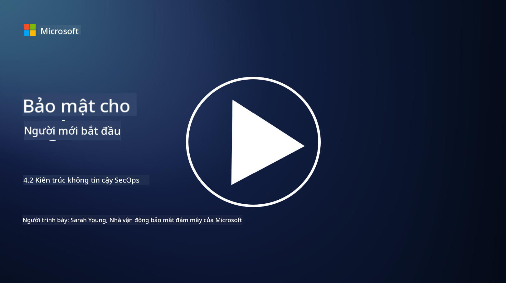

<!--
CO_OP_TRANSLATOR_METADATA:
{
  "original_hash": "45bbdc114e70936816b0b3e7c40189cf",
  "translation_date": "2025-09-04T00:45:52+00:00",
  "source_file": "4.2 SecOps zero trust architecture.md",
  "language_code": "vi"
}
-->
# Kiến trúc zero trust cho hoạt động bảo mật

Hoạt động bảo mật là một phần quan trọng trong kiến trúc zero trust, và trong bài học này, chúng ta sẽ tìm hiểu về cả hai khía cạnh:

- Làm thế nào để xây dựng kiến trúc CNTT cho phép thu thập nhật ký tập trung?

- Các phương pháp tốt nhất cho hoạt động bảo mật trong môi trường CNTT hiện đại là gì?

## Làm thế nào để xây dựng kiến trúc CNTT cho phép thu thập nhật ký tập trung?

Thu thập nhật ký tập trung là một thành phần quan trọng trong hoạt động bảo mật hiện đại. Nó cho phép các tổ chức tập hợp nhật ký và dữ liệu từ nhiều nguồn khác nhau, như máy chủ, ứng dụng, thiết bị mạng và công cụ bảo mật, vào một kho lưu trữ trung tâm để phân tích, giám sát và phản ứng với sự cố. Dưới đây là một số phương pháp tốt nhất để xây dựng kiến trúc CNTT hỗ trợ thu thập nhật ký tập trung:

1. **Tích hợp nguồn nhật ký**:

- Đảm bảo rằng tất cả các thiết bị và hệ thống liên quan được cấu hình để tạo nhật ký. Điều này bao gồm máy chủ, tường lửa, bộ định tuyến, bộ chuyển mạch, ứng dụng và thiết bị bảo mật.

- Cấu hình các nguồn nhật ký để chuyển tiếp nhật ký đến một hệ thống thu thập hoặc quản lý nhật ký tập trung.

2. **Chọn công cụ SIEM phù hợp**:

- Chọn một giải pháp SIEM (Quản lý thông tin và sự kiện bảo mật) phù hợp với nhu cầu và quy mô của tổ chức.

- Đảm bảo giải pháp được chọn hỗ trợ thu thập, tập hợp, phân tích và báo cáo nhật ký.

3. **Khả năng mở rộng và dự phòng**:

- Thiết kế kiến trúc có khả năng mở rộng để đáp ứng số lượng nguồn nhật ký ngày càng tăng và khối lượng nhật ký lớn hơn.

- Triển khai dự phòng để đảm bảo tính sẵn sàng cao, tránh gián đoạn do lỗi phần cứng hoặc mạng.

4. **Vận chuyển nhật ký an toàn**:

- Sử dụng các giao thức an toàn như TLS/SSL hoặc IPsec để vận chuyển nhật ký từ các nguồn đến kho lưu trữ tập trung.

- Triển khai xác thực và kiểm soát truy cập để đảm bảo chỉ các thiết bị được ủy quyền mới có thể gửi nhật ký.

5. **Chuẩn hóa**:

- Chuẩn hóa định dạng nhật ký và dữ liệu để đảm bảo tính nhất quán và dễ dàng phân tích.

6. **Lưu trữ và duy trì**:

- Xác định thời gian lưu trữ nhật ký phù hợp dựa trên các yêu cầu tuân thủ và bảo mật.

- Lưu trữ nhật ký một cách an toàn, bảo vệ chúng khỏi truy cập trái phép và giả mạo.

## Các phương pháp tốt nhất cho hoạt động bảo mật trong môi trường CNTT hiện đại là gì?

Ngoài việc thu thập nhật ký tập trung, dưới đây là một số phương pháp tốt nhất cho hoạt động bảo mật trong môi trường CNTT hiện đại:

1. **Giám sát liên tục**: Triển khai giám sát liên tục các hoạt động mạng và hệ thống để phát hiện và phản ứng với các mối đe dọa theo thời gian thực.

2. **Thông tin về mối đe dọa**: Luôn cập nhật thông tin về các mối đe dọa và lỗ hổng mới bằng cách sử dụng các nguồn cung cấp thông tin về mối đe dọa.

3. **Đào tạo người dùng**: Tổ chức các khóa đào tạo nhận thức về bảo mật thường xuyên cho nhân viên để giảm thiểu rủi ro liên quan đến kỹ thuật xã hội và tấn công lừa đảo.

4. **Kế hoạch phản ứng sự cố**: Phát triển và kiểm tra kế hoạch phản ứng sự cố để đảm bảo phản ứng nhanh chóng và hiệu quả với các sự cố bảo mật.

5. **Tự động hóa bảo mật**: Sử dụng các công cụ tự động hóa và điều phối bảo mật để tối ưu hóa phản ứng sự cố và các tác vụ lặp lại.

6. **Sao lưu và khôi phục**: Triển khai các giải pháp sao lưu và khôi phục mạnh mẽ để đảm bảo tính khả dụng của dữ liệu trong trường hợp mất dữ liệu hoặc tấn công ransomware.

## Đọc thêm

- [Mô-đun Thực hành tốt nhất về bảo mật của Microsoft: Hoạt động bảo mật | Microsoft Learn](https://learn.microsoft.com/security/operations/security-operations-videos-and-decks?WT.mc_id=academic-96948-sayoung)
- [Hoạt động bảo mật - Khung áp dụng đám mây | Microsoft Learn](https://learn.microsoft.com/azure/cloud-adoption-framework/secure/security-operations?WT.mc_id=academic-96948-sayoung)
- [Kiến trúc Nền tảng Phân tích và Hoạt động Bảo mật là gì? Định nghĩa SOAPA, Cách Hoạt động, Lợi ích và Hơn thế nữa (digitalguardian.com)](https://www.digitalguardian.com/blog/what-security-operations-and-analytics-platform-architecture-definition-soapa-how-it-works#:~:text=All%20in%20all%2C%20security%20operations%20and%20analytics%20platform,become%20more%20efficient%20and%20operative%20with%20your%20security.)

---

**Tuyên bố miễn trừ trách nhiệm**:  
Tài liệu này đã được dịch bằng dịch vụ dịch thuật AI [Co-op Translator](https://github.com/Azure/co-op-translator). Mặc dù chúng tôi cố gắng đảm bảo độ chính xác, xin lưu ý rằng các bản dịch tự động có thể chứa lỗi hoặc không chính xác. Tài liệu gốc bằng ngôn ngữ bản địa nên được coi là nguồn tham khảo chính thức. Đối với các thông tin quan trọng, chúng tôi khuyến nghị sử dụng dịch vụ dịch thuật chuyên nghiệp từ con người. Chúng tôi không chịu trách nhiệm cho bất kỳ sự hiểu lầm hoặc diễn giải sai nào phát sinh từ việc sử dụng bản dịch này.