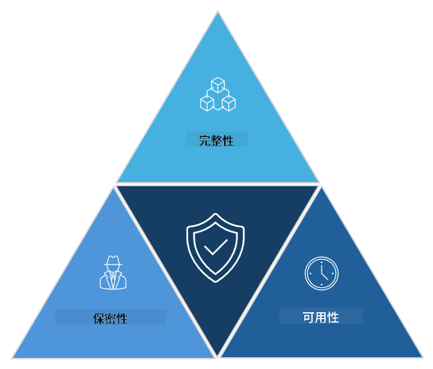

<!--
CO_OP_TRANSLATOR_METADATA:
{
  "original_hash": "16a76f9fa372fb63cffb6d76b855f023",
  "translation_date": "2025-09-03T17:40:03+00:00",
  "source_file": "1.1 The CIA triad and other key concepts.md",
  "language_code": "zh"
}
-->
# CIA 三要素及其他关键概念

## 介绍

在本课中，我们将讨论：

 - 什么是网络安全？
   
 - 什么是网络安全的 CIA 三要素？

 - 在网络安全的背景下，真实性、不可抵赖性和隐私分别指什么？

## 什么是网络安全？

网络安全，也称为信息安全，是保护计算机系统、网络、设备和数据免受数字攻击、未经授权的访问、损坏或盗窃的实践。网络安全的主要目标是确保数字资产和信息的机密性、完整性和可用性。网络安全专业人员设计并实施安全控制措施，以保护资产、数据和信息。随着我们的生活越来越数字化和在线化，网络安全已成为个人和组织的首要关注点。

## 什么是网络安全的 CIA 三要素？

网络安全三要素是指在任何网络安全工作或系统/环境设计中需要考虑的三个主要方面：

### 机密性

这是大多数人在想到“网络安全”时最熟悉的方面：机密性是保护数据和信息免受未经授权访问的过程，即只有需要查看信息的人才能访问它。然而，并非所有数据都是一样的，数据通常会根据如果被错误的人访问可能造成的损害程度进行分类和保护。

### 完整性

完整性指的是保护环境中数据的准确性和可信度，防止数据被未经授权的人篡改或修改。例如，一个学生在 DMV（车辆管理局）修改了自己的出生日期记录，使自己看起来更大，以便重新打印驾照并购买酒精。

### 可用性

可用性是整个 IT 运营中的一个重要考虑因素，但在网络安全中也同样重要。有些特定类型的攻击专门针对可用性，安全专业人员必须加以防范（例如分布式拒绝服务攻击——DDoS 攻击）。

**网络安全 CIA 三要素**

## 在网络安全背景下，真实性、不可抵赖性和隐私分别指什么？

这些是确保系统和数据安全性与可信度的其他重要概念：

**真实性** - 指确保您正在交互的信息、通信或实体是真实的，且未被未经授权的方篡改或修改。

**不可抵赖性** - 是指确保某一方无法否认其参与或某一交易或通信的真实性。它防止某人声称自己没有发送某条消息或执行某个操作，而实际上有证据表明他们确实这样做了。

**隐私** - 指保护敏感和个人身份信息免受未经授权的访问、使用、披露或篡改。隐私涉及控制谁可以访问个人数据，以及这些数据如何被收集、存储和共享。

## 延伸阅读

[什么是信息安全（InfoSec）？| Microsoft Security](https://www.microsoft.com/security/business/security-101/what-is-information-security-infosec#:~:text=Three%20pillars%20of%20information%20security%3A%20the%20CIA%20triad,as%20guiding%20principles%20for%20implementing%20an%20InfoSec%20plan.)

---

**免责声明**：  
本文档使用AI翻译服务 [Co-op Translator](https://github.com/Azure/co-op-translator) 进行翻译。尽管我们努力确保翻译的准确性，但请注意，自动翻译可能包含错误或不准确之处。原始语言的文档应被视为权威来源。对于重要信息，建议使用专业人工翻译。我们不对因使用此翻译而产生的任何误解或误读承担责任。