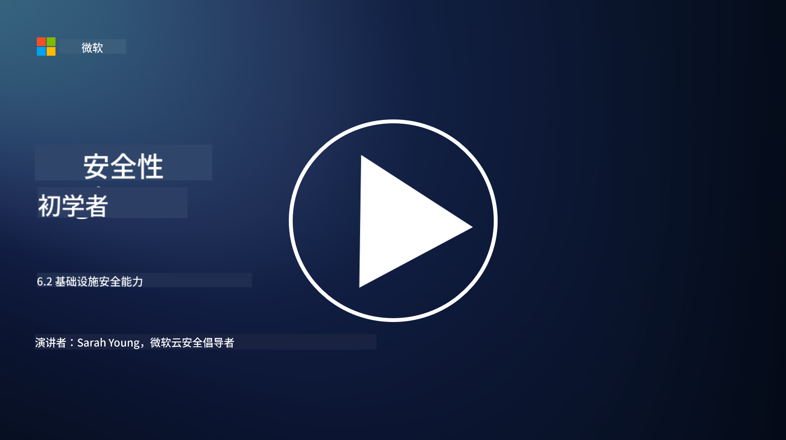

<!--
CO_OP_TRANSLATOR_METADATA:
{
  "original_hash": "7d79ba0e7668b3bdae1fba7aa047f6c0",
  "translation_date": "2025-09-03T17:24:30+00:00",
  "source_file": "6.2 Infrastructure security capabilities.md",
  "language_code": "zh"
}
-->
# 基础设施安全能力

在本节中，我们将详细介绍用于基础设施安全的核心工具和能力。

**简介**

在本课程中，我们将讨论：

- 什么是漏洞管理？

- 什么是CSPM？

- 什么是CNAPP？

## 什么是漏洞管理？

漏洞管理是一种系统化的过程，用于识别、评估、优先处理、缓解和监控计算机系统、软件、网络和基础设施中的漏洞。漏洞管理的主要目标是通过主动解决已知漏洞，减少组织面临的安全风险，从而防止恶意行为者利用这些漏洞。以下是关键步骤的概述：

识别：扫描并发现组织资产中的漏洞，这些资产可能包括服务器、应用程序、网络设备和终端。

评估：根据通用漏洞评分系统（CVSS）分数和业务背景等因素，评估每个漏洞的严重性和潜在影响。

优先级排序：根据漏洞的风险级别和对组织运营及数据的潜在影响进行排序。

缓解：制定并实施解决或缓解漏洞的策略，包括应用补丁、配置安全设置或部署补偿控制措施。

验证：确认缓解措施是否有效解决了漏洞。

持续监控：通过定期漏洞扫描和评估，持续跟踪漏洞和潜在威胁。

漏洞管理是网络安全的重要组成部分，帮助组织保持强大的安全态势，降低安全漏洞的可能性。漏洞管理工具的例子包括Defender for Cloud、Nessus和Qualys。

## 什么是CSPM？

云安全态势管理（CSPM）是一套工具、流程和实践，用于评估、监控和实施云环境中的安全配置和最佳实践。CSPM解决方案帮助组织识别并修复云基础设施中的配置错误、安全漏洞和合规性问题，例如在Amazon Web Services (AWS)、Microsoft Azure、Google Cloud Platform (GCP)以及其他云服务提供商中。

CSPM的关键方面包括：

- 配置评估：扫描云资源和服务，识别配置错误、不安全设置以及偏离安全最佳实践的情况。

- 安全策略实施：通过自动修复配置错误或生成警报，在云环境中实施安全策略和合规标准。

- 持续监控：提供对云资产和资源安全态势的持续可见性，并实时警报安全事件。

- 合规报告：生成报告和仪表板，以展示对法规要求和行业标准的合规性。

CSPM帮助组织确保其云基础设施安全、合规并符合最佳实践，从而降低与云相关的安全事件风险。CSPM工具的例子包括Defender for Cloud和Snyk。

## 什么是CNAPP？

CNAPP代表云原生应用保护平台（Cloud-Native Application Protection Platform）。它是一种集成的云原生软件平台，简化了对潜在云安全威胁和漏洞的监控、检测和响应。CNAPP将多种工具和能力整合到一个软件解决方案中，以减少复杂性并促进DevOps和DevSecOps团队的操作。CNAPP在整个CI/CD应用生命周期中，从开发到生产，提供端到端的云和应用安全。它满足了行业对现代云安全监控、态势管理、漏洞预防和控制工具的需求。CNAPP解决方案使安全团队能够量化并响应云环境中的风险。CNAPP的一些功能包括增强的可见性、风险量化、安全软件开发以及综合的云安全解决方案。CNAPP将传统上分散的多个云安全解决方案整合到一个用户界面中，使组织更容易保护其整个云应用足迹。CNAPP整合了多个云原生安全工具和数据源，包括容器扫描、云安全态势管理、基础设施代码扫描、云基础设施权限管理以及运行时云工作负载保护平台。

## 延伸阅读
- [什么是CSPM？ | Microsoft Security](https://www.microsoft.com/security/business/security-101/what-is-cspm?WT.mc_id=academic-96948-sayoung)
- [什么是云安全态势管理（CSPM）？ | HackerOne](https://www.hackerone.com/knowledge-center/what-cloud-security-posture-management)
- [云安全态势管理的功能 - 云采用框架 | Microsoft Learn](https://learn.microsoft.com/azure/cloud-adoption-framework/organize/cloud-security-posture-management?WT.mc_id=academic-96948-sayoung)
- [什么是CNAPP？ | Microsoft Security](https://www.microsoft.com/security/business/security-101/what-is-cnapp?WT.mc_id=academic-96948-sayoung)
- [为什么大家都在谈论CNAPP (forbes.com)](https://www.forbes.com/sites/forbestechcouncil/2021/12/10/why-everyone-is-talking-about-cnapp/?sh=567275ca1549)
- [通过云原生应用保护平台（CNAPP）提升多云安全](https://www.youtube.com/watch?v=5w42kQ_QjZg&t=212s)

---

**免责声明**：  
本文档使用AI翻译服务[Co-op Translator](https://github.com/Azure/co-op-translator)进行翻译。尽管我们努力确保翻译的准确性，但请注意，自动翻译可能包含错误或不准确之处。原始语言的文档应被视为权威来源。对于关键信息，建议使用专业人工翻译。我们不对因使用此翻译而产生的任何误解或误读承担责任。