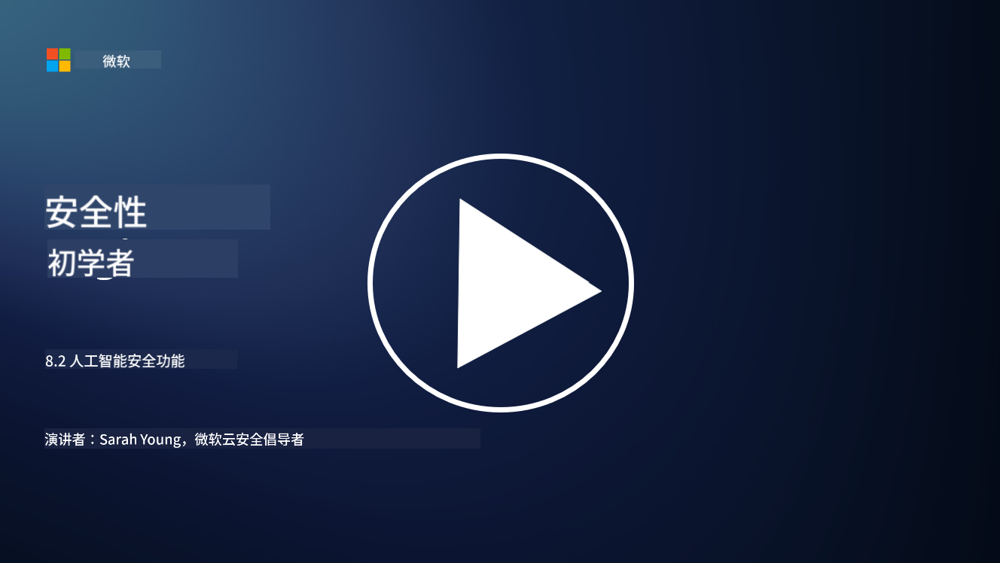

<!--
CO_OP_TRANSLATOR_METADATA:
{
  "original_hash": "b6bb7175672298d1e2f73ba7e0006f95",
  "translation_date": "2025-09-03T17:38:43+00:00",
  "source_file": "8.2 AI security capabilities.md",
  "language_code": "zh"
}
-->
# AI 安全能力

## 我们目前有哪些工具和能力来保护 AI 系统？

目前，有多种工具和能力可用于保护 AI 系统：

-   **Counterfit**：一个开源自动化工具，用于对 AI 系统进行安全测试，帮助组织进行 AI 安全风险评估并确保算法的稳健性。
-   **对抗性机器学习工具**：这些工具评估机器学习模型在面对对抗性攻击时的稳健性，帮助识别并减轻漏洞。
-   **AI 安全工具包**：提供保护 AI 系统的开源工具包，包括用于实施安全措施的库和框架。
-   **协作平台**：公司与 AI 社区之间的合作，开发专门针对 AI 的安全扫描器及其他工具，以保护 AI 供应链。

这些工具和能力是一个不断发展的领域，致力于增强 AI 系统在各种威胁下的安全性。它们结合了研究、实用工具和行业合作，旨在解决 AI 技术带来的独特挑战。

## 那么 AI 红队测试呢？它与传统安全红队测试有何不同？

AI 红队测试与传统安全红队测试在几个关键方面有所不同：

-   **专注于 AI 系统**：AI 红队测试专门针对 AI 系统的独特漏洞，例如机器学习模型和数据管道，而不是传统的 IT 基础设施。
-   **测试 AI 行为**：它测试 AI 系统如何应对异常或意外输入，从而揭示可能被攻击者利用的漏洞。
-   **探索 AI 失败**：AI 红队测试不仅关注恶意失败，还包括善意失败，考虑更广泛的角色和潜在系统故障，而不仅仅是安全漏洞。
-   **提示注入和内容生成**：AI 红队测试还包括探测诸如提示注入等失败情况，攻击者可能通过操控 AI 系统生成有害或不准确的内容。
-   **伦理与负责任的 AI**：它是确保设计负责任 AI 的一部分，确保 AI 系统能够抵御试图让其产生意外行为的攻击。

总体而言，AI 红队测试是一种扩展的实践，不仅涵盖安全漏洞的探测，还包括测试 AI 技术特有的其他类型的系统故障。它是开发更安全 AI 系统的重要组成部分，通过理解和减轻 AI 部署相关的新风险来实现。

## 延伸阅读

 - [Microsoft AI Red Team building future of safer AI | Microsoft Security Blog](https://www.microsoft.com/en-us/security/blog/2023/08/07/microsoft-ai-red-team-building-future-of-safer-ai/?WT.mc_id=academic-96948-sayoung)
 - [Announcing Microsoft’s open automation framework to red team generative AI Systems | Microsoft Security Blog](https://www.microsoft.com/en-us/security/blog/2024/02/22/announcing-microsofts-open-automation-framework-to-red-team-generative-ai-systems/?WT.mc_id=academic-96948-sayoung)
 - [AI Security Tools: The Open-Source Toolkit | Wiz](https://www.wiz.io/academy/ai-security-tools)

---

**免责声明**：  
本文档使用AI翻译服务[Co-op Translator](https://github.com/Azure/co-op-translator)进行翻译。尽管我们努力确保翻译的准确性，但请注意，自动翻译可能包含错误或不准确之处。原始语言的文档应被视为权威来源。对于关键信息，建议使用专业人工翻译。我们不对因使用此翻译而产生的任何误解或误读承担责任。